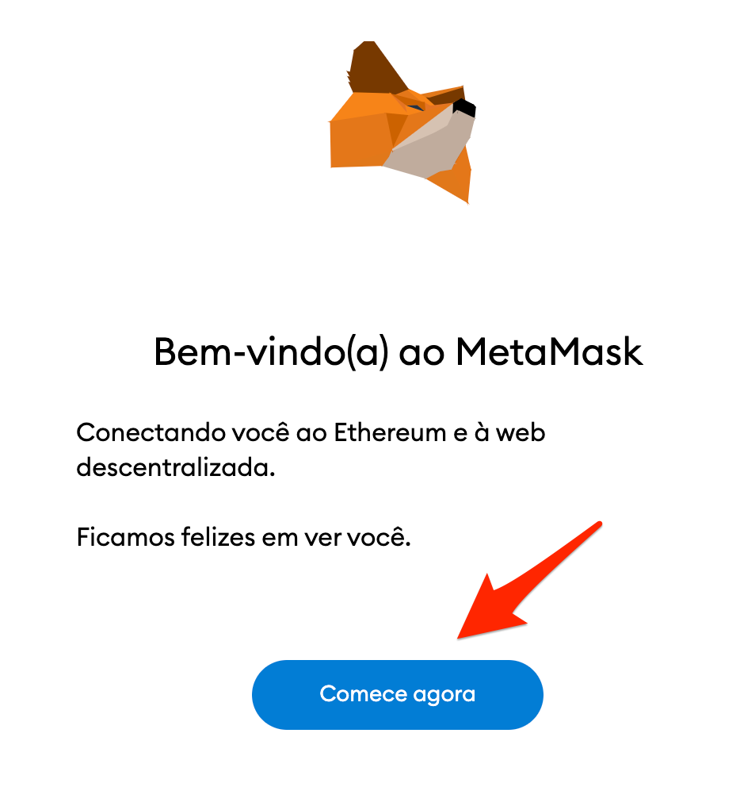
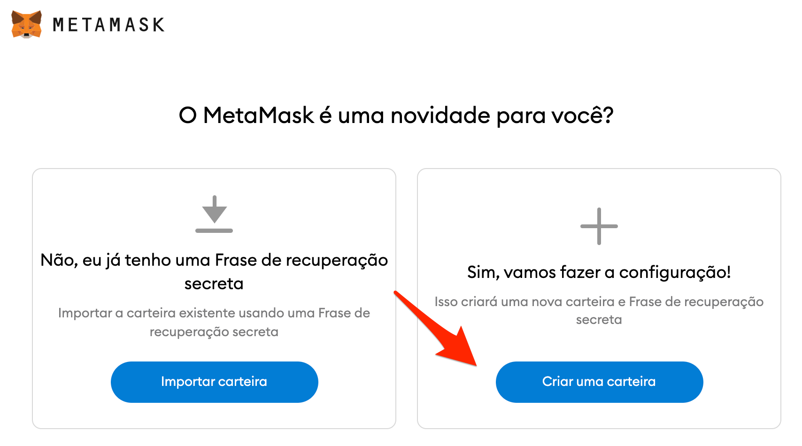

# Install a Wallet on Computer

### 1. Download Metamask App

Go to Metamask download page on[ https://metamask.io/download.html](https://metamask.io/download.html)​

The site will recognize which browser you are using and will suggest the correct link.


**Watch out!** It is very important that you trust the source you are installing from. If it is an unsafe source, you may install a version of the app that can be hacked and your funds will be lost.


You must be sure the official website link is correct. I say it, metamask official website is **metamask.io**.

The browser used for this tutorial was Chrome, but the screens of the other browsers are very similar and you will have no problem proceeding based on the following screens.


My PC is set to English, so the screens may be a little different from yours if you have your PC set to another language.


### 2. Once installed, we’ll show the icon as default

By clicking on the extensions icon and on the MetaMask pin, the MetaMask icon will show up on the toolbar. Click on the metamask icon to open the configuration window.

### 3. Since it is your first time, click on "Create a new wallet"

### 4. In the next step click on "No Thank you"

If you don’t do this, you would allow your usage data to be sent to the app team. No wallet or transaction data is shared, nor is any data that identifies you, and they promise not to share it with anybody. There is no risk in allowing it, but I personally prefer not to.

### 5. Set up a password to use your wallet

In this step you must choose a password to access your wallet. Anyone who accesses your computer and knows your password is able to access your funds and steal your money.


**Watch out!** Choose a password with at least one lowercase, one uppercase, one number and one special character. Don’t write this password down on paper and even less in a file on your mobile or computer. I recommend using [1Password](https://1password.com/pt/) to store your passwords.


### 6. Wallet set up

You are the only responsible for the security of your wallet. In the web3 environment there is no bank to whom you can claim on and ask for your money back in case you are the victim of an attack or if you do something wrong. 

Your wallet is your safe. It is where you will handle the money you hold in the Blockchain.

Your wallet is accessed by a code called a private key. This private key is the password which allows you to manipulate the money in your wallet. This private key is represented by the set of 12 words called **Seed Phrase**.

Anyone who can access these 12 words will be able to steal all your funds.

### 7. Store you seed phrase

It is very important that you correctly store your Seed Phrase safely.


**Watch out!** Under no circumstances should you keep these words on your mobile or computer, even less take a snapshot of them, because that way the information will be at risk in case your mobile or computer is hacked.


A safe way to store your seed phrase is to write it down on a piece of paper with a ballpoint pen and store it in a safe place at home, preferably in a safe. Some people wrap the piece of paper with the words with aluminum foil to preserve it in case of an accident.

First click on "Reveal Secret Words". Then write down the words in the order they appear. On the next screen you will need to choose the words in the correct order to check if you wrote them down correctly.


The order of the words is essential for you to recover your wallet.


### 8. Congratulations! You have configurated your wallet!

### 9. Copying the Public Address

The public address is a code you share with others so they can send you coins.

The public address is like your bank account number or your bank key.

The format of this address changes according to different blockchains. Metamask uses Ethereum-based blockchains and its format is always a sequence of codes beginning with 0x

Your address appears partially below the name of the account (Account 1).

In my case, my address looks like this **0xa04...5878**

In fact, my address is not exactly this one, because it is shortened with three dots in the middle. 

To copy your public address, click on the following extension with the shortened code.

### 10. Ready! Now send your public address to Discord

Go to the [Melk Experiment Mission 1 channel](https://discord.gg/2SjfbXw6pd) on Discord and send in your wallet address to earn 1 MELK.


Quick reminder! Your seed phrase is the security of all your tokens. Don't save on your phone or computer, just write it down with a pen on paper and never share it with anyone. Some scam sites will ask for your words to recover your wallet, but you should never give out your seed words.

