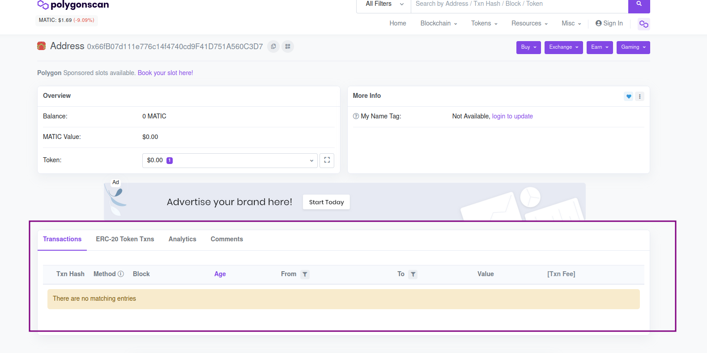

# Mission 3

We are evolving. In the last two missions, we set up our Metamask wallet and included the Polygon network and the Melk token for visualization. Metamask is just a way to visualize a part of what is on the blockchain. Metamask is more focused on managing your balance on each token.

There are other ways to view your wallet and the transactions that took place on the blockchain, which are scan websites. And in this mission we will learn how to use them.


Attention, do not confuse `scan` with `scam`! Scan with N means to examine, probe, explore. Scam with M stands for fraud, swindle, a fraudulent scheme. We’re not messing with any scams here, okay!? 😇


Just to recap, when confirming mission 1, you received 1 point something MELK and in mission 2, you received 5 MELK. There were two transactions carried out to reward your good performance.

So let's learn to view these transactions.

Each blockchain has one or more websites that can be used to view transactions, but each has an "official" website that most people use.

In Ethereum’s case the most famous website is Etherscan, which can be accessed at [https://etherscan.io/](https://etherscan.io)

There’s also  [https://ethplorer.io/](https://ethplorer.io), o [https://ethblockexplorer.org/](https://ethblockexplorer.org) e o [https://explorer.bitquery.io/ethereum](https://explorer.bitquery.io/ethereum). Feel free to explore them later just out of curiosity. The difference between them is the way they show the information, the easiness to save addresses and the monitoring with notifications by e-mail for certain transactions.

As we are using the Polygon network, we are going to use Polygon Scan for our exercise.

### 1. Access the Polygonscan website

Open your browser and go to [https://polygonscan.com/](https://polygonscan.com)

You will see a page as shown in the image below.

.png>)

### 2. Copy and paste your address into the search field.

Do you remember mission 1 where we copied our public address (similar to a Bank key, bank account number) from Metamask? For this mission, we'll have to copy it again.

Open the Metamask extension at the top right of your browser. Then copy your public address as shown in the image:

.png>)

After copying the address, paste it into the PolygonScan search field and click the search icon.

.png>)

The result should be similar to this. Let's find our transactions!

.png>)

### 3. Finding the transactions

Let's confirm that we are on the same screen. It should look like this:

Let's understand a little more about this part highlighted in purple and find the reward transactions of the other missions.

Note that the _Transactions_ section is selected, and even then, our transactions are not showing. This is because this section features transactions on the previously mentioned Polygon network's default token, MATIC. To find our MELK token, we need to go to the _ERC-20 Token Txns_ section. As mentioned before, the MELK token falls into the ERC-20 category, built on top of the Polygon network. Let's click on the ERC-20 tokens section:

There it is! Now we can see our MELK token reward transactions! But before receiving our reward, let's talk a little about transactions.

### 4. Understanding transactions

Simply put, when a transaction is requested and authenticated, it is placed in a block, which will represent the transactions that are within it. It is important to understand that a block contains multiple transactions. On Ethereum, for example, a block can store a number close to 70 transactions. This block is then sent to a queue called pool. When you leave the queue, the validating nodes of the network (which will validate the transaction and place it on the current blockchain) validate the transaction and receive the reward for having validated (an example is Bitcoin miners, which are actually validators). Afterwards, the block is added to the existing blockchain, and this update is distributed across the entire network. After finishing this process, the transaction is complete.

Here is a summary of the process:

.png>)

### 5. Send the first transaction Txn Hash on Discord to receive the reward for this mission

Congratulations on getting here! Head over to the [Melk experiment mission 3 channel on Discord](https://discord.com/invite/uDyHmwBw6E) and send a message with the transaction hash that has the value of 1 MELK token, which we saw on the PolygonScan website. In my case, I would send this value:

.png>)

To copy it completely, click on it. This will take you to another page, like this one, which we will see in the next lessons:

.png>)

From there, just copy from the button marked above and send it on [Discord](https://discord.com/invite/uDyHmwBw6E)!

If you have any questions, feel free to message us on our [Discord chat channel](https://discord.com/channels/898706705779687435/932249635496525834).


In this mission we had 2 lessons: We learned how transactions work and we learned to visualize our transactions using Polygon Network’s Scan site.

