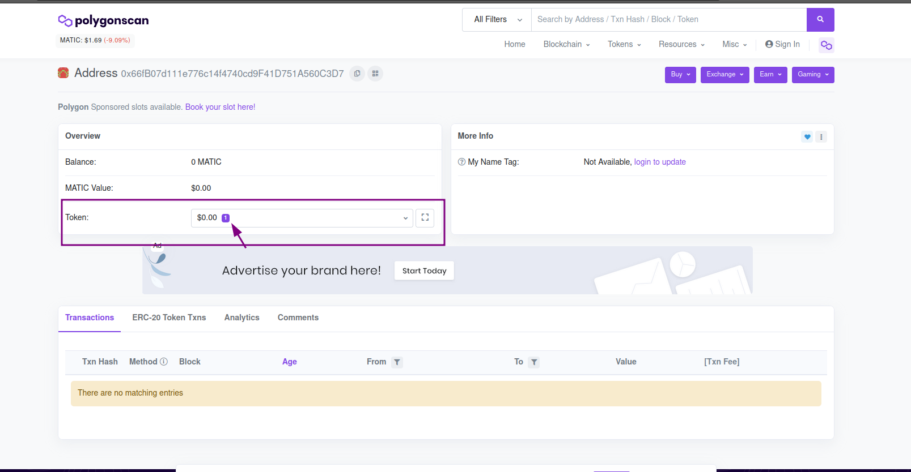
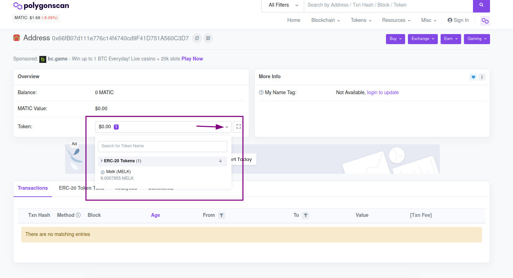

# Missão 4

We are learning! In the last mission we learned how to find our transactions in Polygonscan and to view the reward transactions from previous missions. However, Polygonscan has many details we have not yet analyzed.

A transaction has some data that can be useful in many ways, such as understanding its method, where it comes from, its total amount, if any error occurred, etc.

To recap, in mission 1 you received 1-point-something MELK. Keep it in mind since we will mention it in today’s mission.


This mission will teach you a few things that will sound very technical, but are important for you to have a general understanding of the transactions, the fees charged, and to avoid wasting money when making your actual transactions.


### 1. Opening Polygonscan

To take a deeper look into our transactions, we need to open Polygonscan again as in the previous mission. You can access it [here](https://polygonscan.com/). The screen should look like mine.

 Blockchain Explorer.png>)

### 2. Searching for our Transactions

As you learned in the previous lesson, now we are going to access our transactions. To do this, repeat the process from the previous mission: copy your MetaMask wallet address and paste it into Polygonscan's search bar. The result should look like mine, but with your address:

Let's understand a little about this screen.

### 2.1 Understanding the Screen

First, we are going to understand each section of this part of the screen (highlighted in purple on the image below)

Let’s go in parts:

**2.1.1 Overview**

The overview section is very simple, it is essentially an overview of our search result (i.e. our address).

**2.1.2 Balance**

Balance is the amount of tokens you hold. Matic is the native token of Polygon, and we do not have it yet. That is why our balance is 0 MATIC. To learn more about it, refer to [this link](https://coinext.com.br/matic).

**2.1.3 MATIC Value**

This field shows the total monetary value we have, in dollars, taking our balance into account. Since we do not have any MATIC token, our monetary value is 0. But if we had 1 MATIC token, for example, the value displayed in this field would be based on the token [currency price](https://coinmarketcap.com/currencies/polygon/). At the moment I write this, the MATIC is worth U$1.69 (USD), which represents around R$9 (BRL) according to the current dollar value.

**2.1.4 Token**

In this section we can identify our MELK tokens. Follow the screen bellow:

Observe that the monetary value in the Token field is also zero. That happens because the MELK token does not have a monetary value at first, as explained in [this section](https://melk.gitbook.io/aprenda-e-ganhe/aprender-e-ganhar). Observe the number 1 in purple (pointed by the arrow). It means we have a token contract (in this case, it is the MELK). Click on the dropdown button (next to the highlighted area, on the screenshot below). The result will look like this:

Note that the monetary value and the amount of ERC-20 tokens appear separately from MATIC.This is because ERC-20 tokens are not standard Polygon network tokens, they are built by other developers, like our MELK token. In this section, we were able to identify the MELK token and the amount of tokens we hold (completing the first two missions, 6 tokens + decimal places).

Now, click on the MELK word under which its balance is displayed, as in the image above.

This will take us to another page:

 Token Tracker PolygonScan.png>)

This page has a lot of information about the MELK token. Note that in the overview, we can see the price, the total amount of tokens built and the **Holders** field which shows the number of the MELK token holders. 

Now, let’s go back to the previous screen (where we did the search for our address) and learn more about our transactions.

### 3. Analyzing Transactions

Now, like before, we will search for our transaction in the standard ERC-20 Token’s Txns section, next to Transactions. The result should be like this:

Let's understand this screen and analyze its components, but first click on the transaction of the first mission, with 1-point-something MELK:

Here we will be able to get a broader view of the transaction and understand the meaning of each part. Your screen should look something like this:

 Details PolygonScan.png>)

Click on “Click to see More” to expand the section.

### 3.1 Transaction Hash

The transaction hash is a unique value given to the transaction when it is created. This hash uniquely represents the particular transaction, and each transaction has a different hash. You can, for example, search for a transaction in Polygonscan by its hash. It is a unique identifier.

### 3.2 Status

The status of a transaction basically indicates what happened to it, if a call was successfully completed or if it failed for some reason. In our case you can see the word _Success_ written, which means the transaction was sent successfully.

### 3.3 Block

The word blockchain is a combination of the words block and chain, that is, a chain of blocks. According to what was explained in Mission 1, it consists of a chain of blocks and each block contains a number of transactions. It is the way data is stored.

The block on this screen shows the number of the block where our transaction was recorded. Right next to it, it is possible to see the _Block Confirmation_ log that shows the number of blocks added after the transaction is confirmed.

### 3.4 Timestamp

The term Timestamp is self-explanatory. It basically stores the date and time when the transaction was validated.

### 3.5 From

The From field represents the sender of the transaction, remembering that it may or may not be a contract. It is an address, like ours. In this case it is the wallet address of the Melk BOT that distributes the MELK tokens.

### 3.6 Interacted With (to)

This field shows with whom or what the transaction interacted, and in this case, it is a contract. The green symbol next to the contract address shows that the contract was executed successfully. If it were a MATIC (native currency of the Polygon network) transfer transaction, the To field would show the receiver wallet address that received the transfer amount.

### 3.7 Tokens Transferred

This field is divided into three parts:

* From: shows the sender address
* To: shows the receiver address
* For: shows the amount and name of the token transferred in the transaction

It is important to observe that in your Metamask wallet, the Mission 1 reward transaction amount will not appear with all decimal places. However, the actual total value of the transaction is displayed in this field. MetaMask leaves out some decimal places for a better user experience. 

### 3.8 Value

The Value field shows the monetary value of the transaction. In this case, the MELK token has no monetary value. Therefore, the displayed value is 0 MATIC ($0.00)

### 3.9 Transaction Fee

This field shows the amount paid to the miner for the transaction validation.  All blockchain transactions require a fee payment, even for tokens with no monetary value, like the MELK token.  

Observe that in this case we pay a fee for sending you MELK tokens. To run our experiment we pay these fees for each person who completes a mission. This is a cost we have for running this project.

### 3.10 Txn Type

This field shows the type of transaction executed. In this case, it fits with a change implemented in EIP-1559. The purpose of this change was to have a fixed gas value, which is burned, and to adjust the value based on the block, searching for a less fluctuating average price.

To learn more about EIP-1559, refer to [this link](https://artigos.banklessbr.com/p/eip-1559-explicado?s=r).

### 3.11 MATIC Price

This field shows the closing price of the MATIC currency on the day of the transaction. The value is displayed in dollars, and is used to calculate the total currency value of the gas and to inform what the base value was.

### 3.12 Gas Limit

It is the maximum amount of gas that can be consumed to perform a certain transaction, selected by the user. This means that if the amount of gas exceeds the chosen amount, the transaction will not be completed.

When a transaction is carried out, you can choose the maximum amount of gas that you are willing to pay for the transaction.

### 3.13 Gas Used by Transaction

This field shows the amount of gas used in the transaction in absolute numbers and in percentage format. Note that the percentage is calculated based on the gas limit amount displayed on the previous field.

### 3.14 Base Fee Per Gas

It is the base gas fee, determined by the network. It is also burned at the end of the process. This fee depends directly on the previous block, increasing and decreasing according to its size (full block, fee increases; empty block - fee decreases).

The base fee value, in our case, is measured in Wei (in numbers, 1 Ethereum is worth 1 quintillion of one Wei) and also appears in Gwei (1 Gwei = 0,000000001 Ethereum).

### 3.15 Max Fee Per Gas

This field shows the maximum amount that the user is willing to pay for his transaction to be executed. In the Polygon network, the value is measured in MATIC or Gwei. This value is also chosen by the sender of the transaction. Metamask suggests these values based on the current network usage fee.  

### 3.16 Max Priority Fee Per Gas

This amount (also in Gwei) is the maximum value that is paid to the miner for the transaction. It can be set up by the user.

### 3.17 Burnt Fees

This field shows the fee amount that was burnt, which is explained in EIP-1559, mentioned above.

### 3.18 Txn Savings

This value results from the following mathematical operation:

`(MaxFeePerGas - (BaseFeePerGas + MaxPriorityFeePerGas)) * GasUsed`

and represents the amount of the fee that was saved in the transaction.

### 3.19 Gas Price

This is the unit price specified for the transaction, in MATIC and in Gwei. The higher the Gas price, the greater the chance of having the transaction included in the block.

### 3.20 Nonce / Position

It is a sequential and scalar number equal to the number of transactions from the sender’s address (your wallet, for example). If the Nonce of a transaction is 4, for example, this transaction is the fifth outgoing transaction sent from the sender’s address. 

The first transaction you execute in your wallet begins with nonce zero and the next needs to be sent with nonce 1.

And the Position field is the index of the transaction’s position, in the block where it is located.

### 3.21 Input data

They are the binary data that represent the information sent to the transaction, be it for a message call or an interaction with or even the creation of a _smart contract_.

### 4. Post the total reward value of the first mission on Discord to receive the reward!

Go to the Melk Experiment Mission 4 channel on discord and send a message with the total amount you received in Mission 1, displayed on the Tokens Transferred section. Write down the complete value, with all decimal places, using a point as the decimal separator. In my case, my message would be the following:

> 1.0007855

If you have any questions, feel free to contact us on the [Discord chat-melk channel](https://discord.com/channels/898706705779687435/932249635496525834).


In this mission we learned many things.

* We learned how to interpret the simplified transaction information  screen and to find transactions of other tokens.
* Analyze and understand each field of a complete transaction, understanding the values the network works with.

