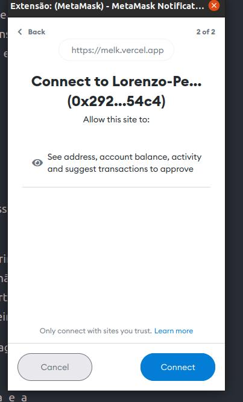

# Mission 5

We are learning a lot of new things. In the last mission, we understood Polygon's explorer, Polygonscan, and learned to visualize our transactions in detail, understanding all the fields and what they mean.

Today we are going to introduce a new concept, that of signing transactions using MetaMask, which we set up in mission 1.

As we have already learned, a blockchain is formed by numerous blocks of transactions, and for each transaction it is necessary to use gas to complete it. We currently do not have gas in our wallet, as the MELK token has no financial value and on the Polygon network, the token used to pay gas fees is MATIC.

However, there is a type of operation that fits the concept of _gas free_, that is, it is not necessary to use gas to be carried out. It is called a signature.

### 1. What are signatures?

Signatures have been used for a long time in our society, and they serve as an authentication mechanism, proving your identity through a signature. In the web3 world, we also have this signature process, which is widely used in login systems. For this, we have a common image of the login paradigm in the different phases of the web:

 (3).png>)

Signatures serve to prove that you own the wallet, that is, that you have its private key, which is often used to log into systems, as shown in the paradigm above.

With the arrival of web3, login will be much simpler, using signatures to prove your identity. In addition to being a much faster and more convenient format, it is as safe as the previous methods.

For today's mission, we are going to learn in practice how to sign a message using Metamask.


Remember: be careful where you connect your wallet for authentication. Malicious websites may use your data for harmful purposes.


### 2. Learning to sign a message

For this mission, we built a special website to interact with Metamask and sign a message.

To access the website, visit: [https://missions.melkdao.com](https://missions.melkdao.com)

Your screen should look like this:

 (3) (1).png>)

First, read the notes for mission 5. We've specified some important details about how this mission will work and what we'll have access to.

Note that at the end of the screen we have a button, which says “Sign Message”:

Click that button. On your screen, a Metamask popup should appear. If it hasn't appeared, check if you don't have any notifications in the chrome extension.

If your metamask is not yet authorized, your screen will look like this:

.png>)

Let's understand what's happening here.

Metamask is asking for the password to unlock your wallet, which **we don't have access to**, and it's just for you to log into the wallet account.

If you are already logged into Metamask, this screen will not appear

### 3. Connection Consent

The second step is the consent you give to the site so that it can read your public address and with that it can identify your wallet balance.

Click “Connect” to proceed.

### 4. Signing the Message

The next screen is the signature request and will look like this image:

 (3).png>)

It is important to notice the title of the window, which says "Signature Request".

Also note that the message you are signing appears on this screen, in this case "MELK Experiment".

The button is also pretty straightforward and says "Sign". When you come across a request like this, rest assured that you are not at risk of spending money or losing the coins in your wallet.

Click “Sign”, and your screen will refresh.

 (1) (1).png>)

To copy the signature hash, click on it:

 (1).png>)

Congratulations! You signed for the first time with your wallet. No information was registered on the Blockchain and so there was no need to pay fees and gas.

The site now has your accomplished signature's _hash_, and having knowledge of the message that was signed, it can validate that you are the holder of the private key relative to the wallet's public address.

This ensures that only you and no one else can generate this signature hash. This process proves your identity. It is a simple, effective and secure login system.

Normally, the signature hash does not appear on the screen and does not need to be manipulated by you, but in our case we show it so that you can use it as proof of the mission.

### 5. All ready! Now post the signature hash on Discord

Head over to the MELK Experiment Mission 5 channel on discord and post your signature hash to earn 10 MELK.


Quick reminder! This mission does not give us access to any sensitive data in your wallet, only your public address, balance and basic read permissions so that the signature hash can be generated and used to verify your identity.

