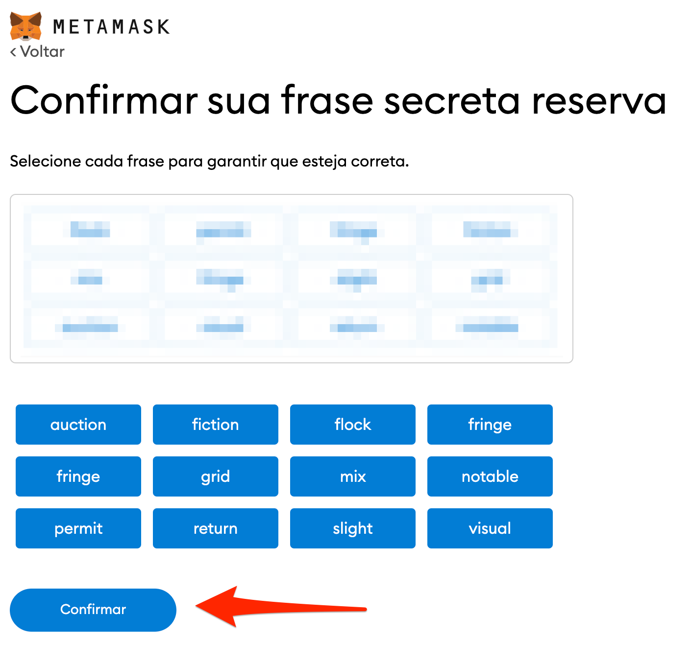

# Instalar una cartera en el Computador

### 1. Descarga la aplicación Metamask

Accede a la página de descarga de Metamask en [https://metamask.io/download.html](https://metamask.io/download.html)

La página detectará cuál navegador estás usando y te sugerirá el enlace correcto.


**¡Atención!** Es muy importante que confíes en la fuente de donde estás haciendo la instalación. Si lo instalas desde una fuente insegura, puedes instalar una versión de la aplicación que podrá ser hackeada y tus fondos se perderán.


Tú necesitas asegurarte que el enlace del sitio web oficial es correcto. Yo te digo, el sitio web oficial de metamask es **metamask.io**

El tutorial fue hecho usando Chrome, pero las pantallas de los otros navegadores son muy similares y no tendrás problema en seguir basándote en estas.


Mi computador está configurado para el idioma Inglés por defecto, entonces puede ser que las pantallas sean un poco diferente de las de tu computador, si está configurado para usar Español.


### 2. Una vez instalado, mostraremos el icono por defecto

Al hacer clic en el icono de extensiones y en el pin de MetaMask, el icono de MetaMask aparecerá en la barra de herramientas. Haz clic en el icono de Metamask para abrir la ventana de configuración.

### 3. Como es tu primera vez, haz clic en Crear una nueva cartera

### 4. En el siguiente paso haz clic en No Gracias 

Estarías permitiendo que datos tuyos sean enviados para el equipo de la aplicación.  Ningún dato de la cartera o la transacción es compartido, ni ningún dato que te identifique y ellos prometen no compartir con nadie. No existe riesgo en permitir, pero yo particularmente prefiero no permitir.

### 5. Establece una contraseña para usar la cartera

En este paso es necesario elegir una contraseña para acceder a tu cartera. Cualquier persona que tenga acceso a tu computador y sepa esa contraseña podrá tener acceso a tus fondos y robar tu dinero.


**¡Atención!** Elige una contraseña con por lo menos una minúscula, una mayúscula, un número y un carácter especial. No anotes esta contraseña en un papel y mucho menos en un archivo en el celular o el computador. Recomiendo el uso de [1Password](https://1password.com/pt/) para anotar tus contraseñas.


### **6. Configuración de la cartera**

Tú eres el único responsable por la seguridad de tu cartera. En el ambiente web3 no tenemos un banco para que puedas reclamar y pedir el dinero de regreso en caso de que seas víctima de un ataque o hagas alguna tontería.

Tu cartera es tu caja fuerte, es por donde podrás manejar el dinero que tienes de Blockchain.

A tu cartera accedes por un código, llamado llave privada. Esa llave privada es la contraseña que te permite manejar el dinero de la cartera. Esa llave privada está representada por el conjunto de 12 palabras, llamadas _Seed Phrases_ (Palabras Semillas).

Si alguien tiene acceso a esas 12 palabras, podrá robar todos tus fondos

### **7. Guarda las palabras semillas**

Es muy importante, que hagas de manera correcta, la seguridad de tus palabras semillas.


**¡Atención!**No puedes de ninguna forma anotar esas palabras en tu celular o en tu computador, mucho menos tomar una foto de la pantalla. Porque de esa manera la información va a estar en riesgo en caso de que tu celular o computador sea hackeado.


La forma segura de guardar las palabras semillas es anotarlas en un papel con bolígrafo y guardarlas en un lugar seguro en tu casa, de preferencia en una caja fuerte. Hay personas que envuelven el papel donde anotó las palabras en papel aluminio para preservar en caso de accidente.

Primero haz clic en Revelar Palabras Secretas y luego anotas las palabras en el orden en que aparecen. En la siguiente pantalla tendrás que elegir las palabras en el orden para comprobar si lo anotaste bien.


El orden de las palabras es importante para recuperar tu cartera.


### 8. ¡Felicidades, registraste tu cartera

### 9. Copiar la Dirección Pública

La dirección pública es un código que compartes con otras personas para que ellas puedan enviarte monedas.

La dirección pública es como el número de cuenta de tu banco, o como si fuese tu clave PIX.

El formato de esa dirección cambia de acuerdo con las diferentes blockchains. Metamask utiliza blockchains basados en Ethereum y el formato es siempre una secuencia de códigos iniciada por 0x

Tu dirección aparece parcialmente debajo del nombre de la cuenta (Account 1).

En mi caso mi dirección aparece así **0xa04...5878**

En realidad mi dirección no es exactamente esa, porque está acortada con tres puntitos en el medio.

Para copiar tu dirección pública, selecciona esa área con el código acortado y haz clic en copiar.

### 10. ¡Listo! Ahora manda allí en Discord tu dirección pública

Ve al [canal de la Misión 1 del Experimento MELK en discord](https://discord.gg/2SjfbXw6pd) y envía tu cartera para ganar 1 MELK.


¡Recordando! Tus palabras semillas son la seguridad de todos tus tokens. No las guardes en tu celular ni en tu computador, solo escríbelas con bolígrafo en un papel y nunca lo compartas con nadie. Algunos sitios de estafa te van a pedir esas palabras para recuperar tu contraseña, pero nunca les digas tus palabras semillas.
