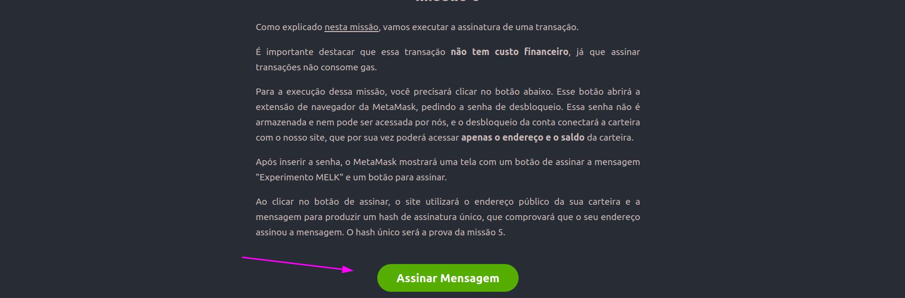
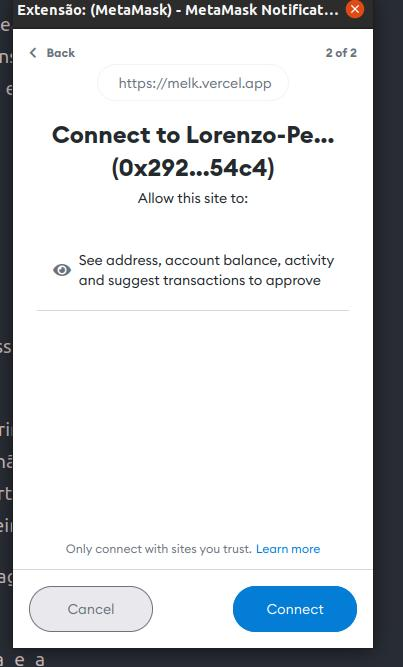

# Missão 5

Estamos aprendendo muitas coisas novas. Na última missão, entendemos o explorer da Polygon, o Polygonscan, e aprendemos a visualizar nossas transações detalhadamente, compreendendo todos os campos e o que eles significam.

Hoje vamos introduzir um novo conceito, o de assinar transações utilizando a MetaMask, que criamos na missão 1.

Como já aprendemos, uma blockchain é formada por inúmeros blocos de transações, e pra cada transação é necessário o uso de gas pra ser completada. Atualmente não temos gas na nossa wallet, já que o token MELK não tem valor financeiro e na rede Polygon o token usado para pagar taxas de gas é o MATIC.

Entretanto, existe um tipo de operação que se encaixa no conceito de _gas free_, ou seja, não é necessário o uso de gas para ser executada. São as assinaturas.

### 1. O que são assinaturas?

Assinaturas são usadas desde muito tempo atrás na nossa sociedade, e servem como um mecanismo de autenticação, provando sua identidade através de uma assinatura. No mundo da web3, também temos esse processo de assinaturas, que são amplamente utilizadas em sistemas de login. Para isso, temos uma imagem comum do paradigma de login nas diferentes fases da web:

 (3).png>)

As assinaturas servem para comprovar que você é dono da carteira, ou seja, que você possui a chave privada, sendo muito usada para fazer login em sistemas, como mostrado no paradigma acima.

Com a chegada da web3, o login será feito de maneira muito mais simples, usando assinaturas para comprovação de identidade. Além de ser um formato muito mais rápido e prático, é tão seguro quanto os métodos antigos.

Para a missão de hoje, vamos aprender na prática como assinar uma mensagem utilizando a Metamask.


Lembre-se: tenha cuidado com os locais nos quais você conecta sua carteira para autenticação. Sites mal intencionados podem utilizar seus dados para fins danosos.


### 2. Aprendendo a assinar uma mensagem

Para essa missão, construímos um site especial para interagir com a Metamask e assinar uma mensagem.

Para acessar o site, visite: [https://missions.melkdao.com](https://missions.melkdao.com)

Sua tela deve ser parecida com essa:

 (3) (1).png>)

Primeiramente, leia as observações pra missão 5. Especificamos alguns detalhes importantes sobre como essa missão vai funcionar e o que nós teremos acesso.

Note que no final da tela temos um botão, escrito Assinar Mensagem:

Clique nesse botão. Na sua tela, deve aparecer um pop-up da Metamask. Caso não tenha aparecido, veja se não tem nenhuma notificação na extensão do chrome.

Caso a sua metamask não esteja liberada ainda, a sua tela será parecida com essa:

.png>)

Vamos entender o que está acontecendo aqui.

A metamask está pedindo a senha de desbloqueio da carteira, a qual **nós não temos acesso,** e serve somente para você entrar na conta da carteira.

Caso você já esteja logado na Metamask essa tela não irá aparecer.

### 3. Consentindo a Conexão

A segunda etapa é o consentimento que você dá ao site para que ele consiga ler o seu endereço público e com isso ele consegue identificar o seu saldo da carteira.

Clique em Connect para prosseguir.

### 4. Assinando a Mensagem

A tela seguinte é a solicitação da assinatura e será parecida com essa imagem:

 (3).png>)

É importante observar o título da janela que diz "Solicitação de assinatura".

Note também que nessa tela aparece a mensagem que você está assinando, neste caso "Experimento MELK".

O botão também é bem direto e diz "Assinar". Quando você se deparar com uma solicitação como esta, fique tranquilo que você não corre risco de gastar dinheiro ou perder moedas da sua carteira.

Clique em Assinar, e sua tela será atualizada.

 (1) (1).png>)

Para copiar o hash da assinatura, clique em cima dela:

 (1).png>)

Parabéns! você realizou sua primiera assinatura com sua carteira. Nenhuma informação foi registrada na Blockchain e por isso não houve necessidade de pagamento de taxas e gas.

O site agora possui o _hash_ da assinatura que você realizou, e tendo conhecimento da mensagem que foi assinada, ele consegue validar que você é detentor da chave privada relativa a o endereço da carteira pública.

Isso garante que só você e mais ninguém consegue gerar esse hash de assinatura. Esse processo comprova a sua identidade. É um sistema de login simples, efetivo e seguro.

Normalmente o hash da assinatura não aparece na tela e não precisa ser manipulado por você, mas no nosso caso nós mostramos para que você possa usá-lo como prova da missão.

### 5. Pronto! Agora manda lá no Discord o hash da assinatura

Vá até o canal da missão 5 do Experimento MELK no discord e mande o hash da assinatura para ganhar 10 MELK.


Lembrando! Essa missão não nos dá acesso a nenhum dado sensível da sua carteira, apenas o endereço público, o saldo e permissões básicas de leitura para que o hash da assinatura possa ser gerado e utilizado para verificar sua identidade.

