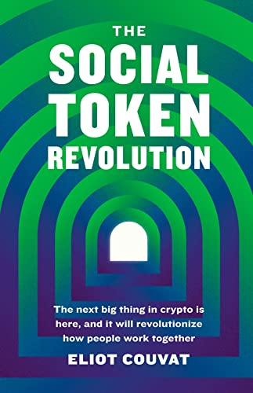

# 💫 Inspiración

El experimento del token $MELK es una copia de $ELIOT.

El [token $ELIOT](https://eliotc.substack.com/p/hello-eliot-a-community-driven-education) fue creado por [Eliot Couvat](https://www.eliotcouvat.com/8d57f85e978743f88d8c4f387fb47bd8)con el propósito de probar el modelo Earn-to-Learn en el nicho de creación de contenido.

Él trabaja para [Coinvise](https://www.coinvise.co), un sistema hecho para que los creadores de contenido creen su propio token y fomenten una comunidad.

Eliot también escribió el libro: [The Social Token Revolution: The next big thing in crypto is here, and it will revolutionize how people work together](https://www.amazon.com.br/Social-Token-Revolution-revolutionize-together-ebook/dp/B09NGSZRBG/ref=sr\_1\_1?\_\_mk\_pt\_BR=%C3%85M%C3%85%C5%BD%C3%95%C3%91\&crid=3J8CNLBV6X3UG\&keywords=The+Social+Token+Revolution\&qid=1642359846\&sprefix=the+social+token+revolution%2Caps%2C157\&sr=8-1).

