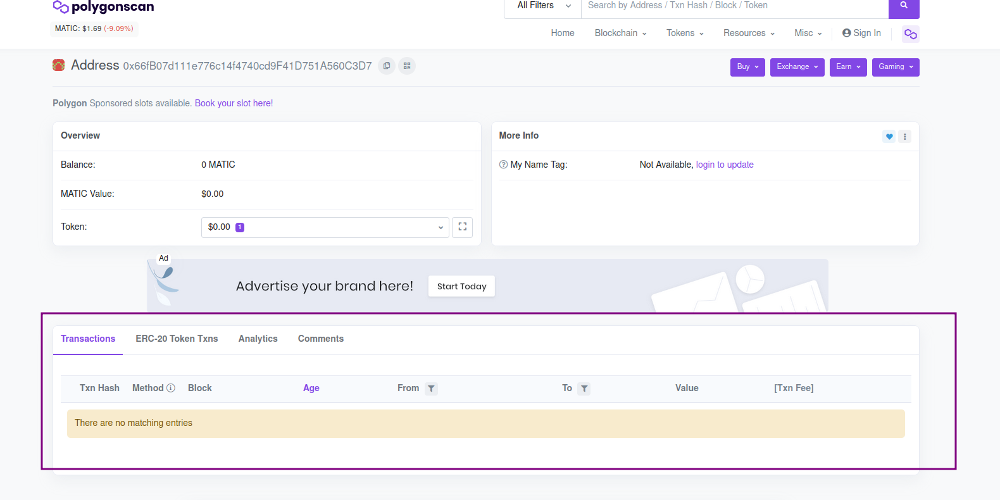

# Misión 3

Estamos evolucionando. En las últimas dos misiones configuramos nuestra cartera en Metamask e incluimos la red Polygon y el token Melk para su visualización. Metamask es sólo una forma de visualizar una parte de lo que está en la blockchain. Metamask está más enfocado en administrar tu saldo en cada token.

Hay otras formas de visualizar tu cartera y las transacciones que ocurrieron en la blockchain, que son los sitios de escaneo. Y en esta misión vamos a aprender a utilizarlos.


¡Atención, no confundas `scan` com `scam`! Scan com N significa examinar, sondear, explorar (escanear en español). Scam con M significa estafa. No vamos a jugar con nada de estafa aquí ¿verdad? :innocent:


Sólo para recapitular, al confirmar la misión 1, tú recibiste 1 punto algo de MELK y en la misión 2 recibiste 5 MELK. Fueron dos transacciones realizadas para recompensar tu buen desempeño.

Entonces, aprendamos a ver estas transacciones.

Cada blockchain tiene uno o más sitios que pueden ser usados para ver las transacciones, pero cada uno tiene un sitio “oficial” que es más utilizado por la mayoría de la gente.

En el caso de Ethereum, el sitio más famoso es Etherscan al que se puede acceder por la dirección [https://etherscan.io/](https://etherscan.io)

También existe [https://ethplorer.io/](https://ethplorer.io), o [https://ethblockexplorer.org/](https://ethblockexplorer.org) y [https://explorer.bitquery.io/ethereum](https://explorer.bitquery.io/ethereum). Eres libre de explorarlos más tarde, sólo por curiosidad. La diferencia entre ellos es la forma en que muestran las informaciones, las facilidades de guardar las direcciones y el seguimiento con envió de notificaciones por correo electrónico para determinadas transacciones.

Como estamos usando la red Polygon vamos a usar Polygon Scan para nuestro ejercicio.

### 1. Accede al sitio web de Polygonscan

Abre tu navegador y accede a la dirección [https://polygonscan.com/](https://polygonscan.com)

Verás una página como se muestra en la imagen de abajo.

.png>)

### 2. Copia y pega tu dirección en el campo de búsqueda

¿Recuerdas la misión 1, donde copiamos nuestra dirección pública (parecida a una clave PIX, número de cuenta bancaria) de Metamask? Para esta misión, tenemos que copiar nuevamente.

Abre la extensión de Metamask, en la parte superior derecha de tu navegador. Luego copia tu dirección pública como se muestra en la imagen:

.png>)

Luego de copiar la dirección, pega en el campo de búsqueda de Polygon Scan y haz clic en el ícono de búsqueda.

.png>)

El resultado debe ser parecido a este. ¡Vamos a encontrar nuestras transacciones!

.png>)

### 3. Encontrar las transacciones

Confirmemos que estamos en la misma pantalla. Debería verse así:

Vamos a entender un poco más acerca de esta parte destacada en morado y encontrar las transacciones de las recompensas de las otras misiones.

Observa que la sección _Transactions_ está seleccionada, y aún así nuestras transacciones no aparecen. Esto sucede porque esta sección presenta transacciones en el token estándar de la red Polygon, MATIC, mencionado anteriormente. Para encontrar nuestro token MELK, necesitamos ir a la sección _ERC-20 Token Txns_. Tal como mencionamos antes, el token MELK se ajusta en la categoría ERC-20, construido sobre la red Polygon. Vamos a hacer clic en la sección de tokens ERC-20:

¡Allí está! ¡Ahora vemos las transacciones de recompensa de nuestro token MELK! Pero antes de recibir nuestra recompensa, hablemos un poco sobre transacciones.

### 4. Entendiendo las transacciones

Explicado de forma sencilla, cuando una transacción es solicitada y autenticada, se coloca sobre un bloque, que representará las transacciones que están dentro de ella. Es importante entender que un bloque contiene varias transacciones. En Ethereum, por ejemplo, un bloque puede almacenar un número cercano a 70 transacciones. Luego, ese bloque es enviado para una fila de espera llamada pool. Al salir de la cola de espera, los nodos validadores de la red (que validarán la transacción y la colocarán en la blockchain actual) validan la transacción y reciben la recompensa por haber validado (un ejemplo son los mineros de Bitcoin, que en realidad son validadores). Luego, el bloque se agrega a la blockchain existente, y esa actualización se distribuye por toda la red. Después de finalizar este proceso, la transacción está completa.

Aquí está un resumen del proceso:

.png>)

### 5.  Envía a Discord el Txn Hash de la primera transacción para recibir la recompensa de esta misión

¡Felicidades por llegar hasta aquí! Ve al [canal de la misión 3 del experimento Melk en Discord](https://discord.com/invite/uDyHmwBw6E) y envía un mensaje con el hash de la transacción con el valor de 1 MELK token que vimos en el sitio web de Polygon Scan. En mi caso, enviaría este valor:

.png>)

Para copiarlo por completo, haz clic arriba de él. Esto te llevará a otra página, como esta, que veremos en las próximas clases:

.png>)

Desde allí, sólo copia el botón marcado arriba y ¡envíalo a [Discord!](https://discord.com/invite/uDyHmwBw6E)

Cualquier pregunta, eres libre de hacerla enviando mensajes en el canal de [chat en Discord](https://discord.com/channels/898706705779687435/932249635496525834).


En esta misión tuvimos 2 aprendizajes: Aprendimos cómo funcionan las transacciones y aprendimos a visualizar nuestras transacciones utilizando el sitio web Scan de la red Polygon.

