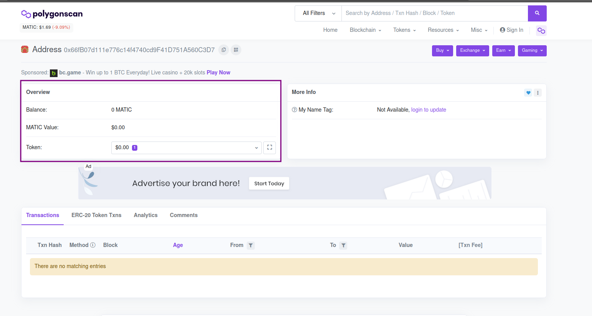
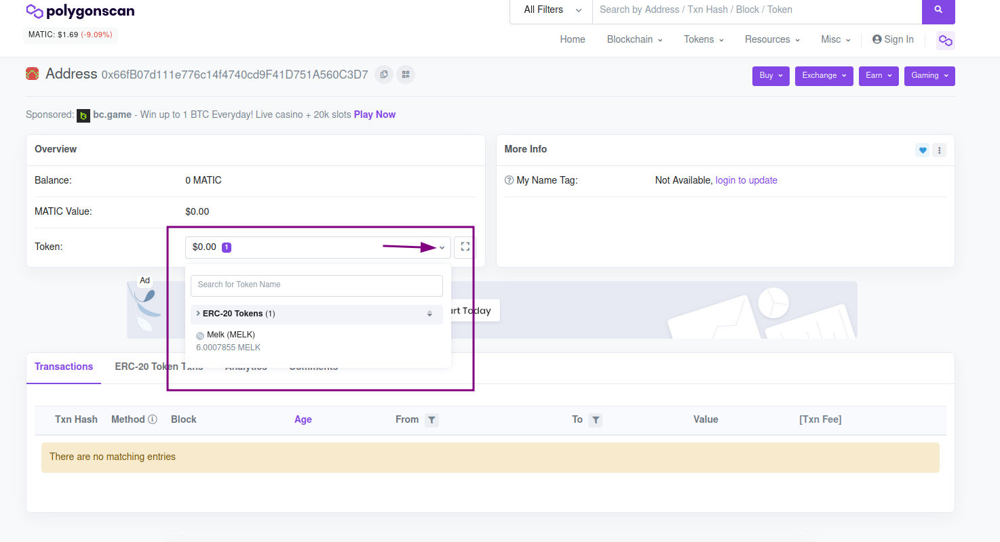
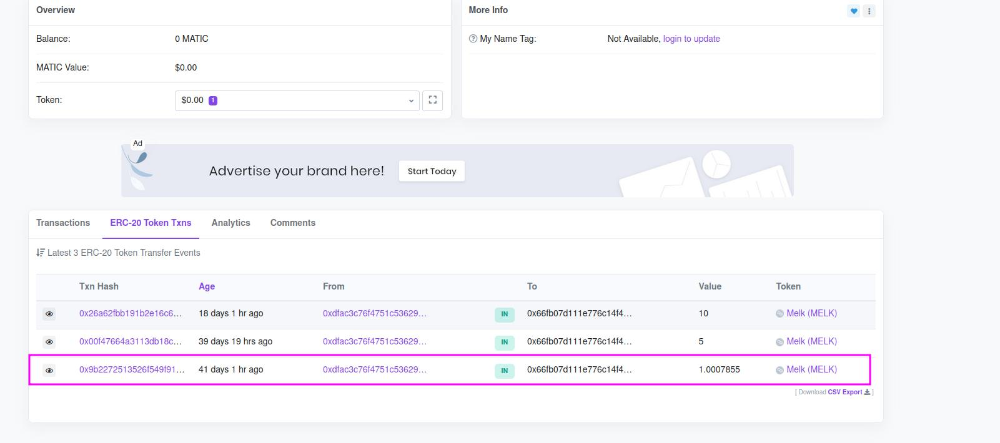

# Misión 4

¡Estamos aprendiendo! En la misión anterior, aprendimos cómo encontrar nuestras transacciones en Polygonscan y ver las transacciones de recompensas de misiones anteriores. Sin embargo, Polygonscan tiene muchos detalles que aún no hemos analizado.

Las transacciones tienen una gran cantidad de datos que nos pueden ayudar de diferentes maneras, entender cómo sucedieron, de dónde vinieron, su valor total, si hubo algún error, etc.

En resumen, en la misión 1 recibiste 1 punto algo del token MELK. Ten eso en cuenta, ya que vamos a hablar sobre esa transacción en la misión de hoy.


Esta misión te enseñará algunas cosas que parecen muy técnicas, pero que son muy importantes para que tengas una comprensión general de las transacciones, las tarifas cobradas y para evitar que pierdas dinero al realizar tus transacciones reales.


### 1. Abriendo Polygonscan

Para analizar más a fondo nuestras transacciones, necesitaremos volver a ingresar a Polygonscan, como en la última misión. Puedes acceder \[aquí] ([https://polygonscan.com/](https://polygonscan.com/)). La pantalla debe parecerse a la mía.

 Blockchain Explorer (1).png>)

### 2. Buscando nuestras transacciones

Como se enseñó en la última clase, ahora accederemos a nuestras transacciones. Para hacer esto, repite el proceso de la misión anterior: copia la dirección de tu billetera Metamask y pégala en la barra de búsqueda de Polygonscan. El resultado debería parecerse al mío, pero con tu dirección:

Entendamos un poco de esta pantalla.

### 2.1 Comprendiendo la pantalla

Primero, entendamos cada sección de esta parte de la pantalla (seleccionada en morado en la imagen de abajo).

Vamos por partes:

**2.1.1 Overview**

La sección de Overview es muy simple, traducida al español, la descripción general se explica por sí misma, es básicamente una descripción general del resultado de nuestra búsqueda (que es tu dirección).

**2.1.2 Balance**

El Balance, en español "saldo", representa cuántos tokens tienes. El token predeterminado para la red Polygon es MATIC, que aún no tenemos. Por tanto, nuestro saldo es 0 MATIC. Si quieres saber más al respecto, echa un vistazo a [este enlace](https://coinext.com.br/matic).

**2.1.3 MATIC Value**

Este campo muestra, en dólares, el valor monetario total que tenemos, teniendo en cuenta nuestro balance. Como no tenemos ningún token MATIC, nuestro valor monetario es 0. Pero si tuviéramos 1 token MATIC, por ejemplo, el valor que se muestra en este campo dependería de la [cotización diaria](https://coinmarketcap.com/currencies/polygon/) del token. Al momento de escribir esto, MATIC vale U$1,69 (en dólares), que con el valor actual del dólar estaría cerca de los 8,96 reales.

**2.1.4 Token**

Esta sección es donde podremos identificar nuestros tokens MELK. A continuación, un ejemplo:

Ten en cuenta que el valor monetario de la sección Token también es cero. Esto se debe a que el token MELK no tiene un valor monetario al principio, como se explica [en esta sección](https://melk.gitbook.io/aprenda-e-ganhe/aprender-e-ganhar). Ten en cuenta el número 1 en morado (resaltado por la flecha). Representa que tenemos un contrato de token (que en nuestro caso es el MELK). Haz clic en el menú desplegable del campo (junto al área rodeada por un círculo, indicada en la imagen a continuación). El resultado será así:

Ten en cuenta que el valor en efectivo y la cantidad de tokens ERC-20 aparecen por separado de MATIC. Esto se debe a que los tokens ERC-20 no son tokens de red Polygon estándar, sino que los construyen otros desarrolladores, como nuestro token MELK. En esta sección, pudimos identificar el token MELK y cuántos tokens tenemos (completando las dos primeras misiones, 6 tokens + decimales).

Ahora, haz clic en la parte donde dice Melk(MELK), con tu saldo abajo, como en la imagen:

Esto nos llevará a otra página:

 Token Tracker PolygonScan.png>)

Esta página presenta diversas informaciones sobre el contrato del token MELK. Ten en cuenta que en la descripción general, podemos ver el precio, la cantidad total de tokens creados y el campo **Holders,** que representa la cantidad de personas que poseen un token MELK.

Ahora volvamos a la pantalla anterior (con nuestra búsqueda de dirección hecha) y aprendamos más sobre nuestras transacciones.

### 3. Análisis de transacciones

Ahora, como antes, busquemos nuestra transacción en el ERC-20 Token Txs estándar, junto a 'Transactions'. El resultado debería ser similar a esto:

Comprendamos esta pantalla y analicemos sus componentes, pero primero, haz clic en la transacción de la primera misión, con 1 punto algo de MELK:

Aquí podremos tener una mayor visión de la transacción y entender lo que significa cada parte. Tu pantalla debería verse algo como esto:

 Details PolygonScan.png>)

Haz clic en "Click to see More" para expandir la sección.

### 3.1 Transaction Hash

El transaction hash (hash de la transacción) es un valor único que produce la transacción cuando se crea. Este hash representa de forma única esa transacción, y cada una tiene un hash diferente. Es posible, por ejemplo, en Polygonscan, buscar la transacción por el hash que posee. Es un identificador único.

### 3.2 Status

El status de la transacción básicamente indica lo que le sucedió, si la llamada se completó con éxito o si falló por algún motivo. En nuestro caso, observe que dice _Success_, lo que indica que la transacción se envió con éxito.

### 3.3 Block

El término blockchain es la unión de las palabras bloque (block) + cadena (chain), es decir, cadena de bloques. Como explicamos en la Misión 1, se compone de una cadena de bloques, y cada bloque tiene numerosas transacciones, que es como se almacenan los datos.

El bloque en esta pantalla es el número de bloque donde se registró nuestra transacción. Justo al lado, puede ver un registro de _Block Confirmations_, que representa cuántos bloques ya se agregaron después de confirmar la transacción.

### 3.4 Timestamp

La timestamp (marca de tiempo) se explica por sí misma y básicamente sirve para almacenar la fecha y la hora en que se validó la transacción.

### 3.5 From

El campo from representa al remitente de la transacción, recordando que puede ser o no un contrato. Es una dirección, como la nuestra. En este caso es la dirección de la billetera BOT Melk que distribuye los tokens MELK.

### 3.6 Interacted With (to)

Este campo representa con quién o con qué interactuó la transacción, en cuyo caso está informando un contrato. El símbolo verde junto a la dirección del contrato demuestra que el contrato se ejecutó con éxito. Si se tratara de una transacción de transferencia MATIC, que es la moneda predeterminada de la red Polygon, el To sería la dirección de la billetera del destinatario que recibió el monto de la transferencia.

### 3.7 Tokens Transferred

Cuenta con tres partes:

* From: representa la dirección que envió los tokens.
* To: la dirección que recibió los tokens.
* For: la cantidad de tokens transferidos en la transacción y el nombre del token.

Es importante tener en cuenta que en tu billetera MetaMask, el valor de transacción de la recompensa de la misión 1 no aparecerá con todos los decimales. Sin embargo, el monto total real de la transacción se muestra en este campo. MetaMask omite los decimales para una mejor experiencia de usuario.

### 3.8 Value

Value representa el valor monetario de la transacción. En este caso, el token MELK no tiene valor financiero. Por tanto, el valor que aparece es 0 MATIC ($0,00)

### 3.9 Transaction Fee

Este campo representa el monto pagado al minero por validar la transacción. Todas las transacciones en la blockchain tienen que pagar tarifas, incluso si el token MELK no tiene valor financiero.

Ten en cuenta que en este caso pagamos una tarifa para poder enviarte tokens MELK. Para ejecutar nuestro experimento, estamos pagando estas tarifas por cada persona que completa una misión, este es un costo que tenemos para ejecutar mantener el proyecto.

### 3.10 Txn Type

Representa el tipo de transacción realizada. En este caso, se ajusta a un cambio implementado en EIP-1559. Este fue un cambio implementado para tener un valor fijo de gas que es quemado (burned), y ​​que el valor se ajuste en base al bloque, buscando un precio promedio con menor fluctuación.

Para obtener más información sobre el EIP-1559, dale un vistazo [a este enlace](https://artigos.banklessbr.com/p/eip-1559-explicado?s=r).

### 3.11 MATIC Price

Este campo representa el valor de cierre de la divisa MATIC en el día de la transacción. El valor se representa en dólares, y se utiliza para calcular el valor total en efectivo del gas y para saber qué valor se tomó como base.

### 3.12 Gas Limit

Es la cantidad máxima de gas disponible para esa transacción específica, elegida por el pagador. Esto significa que si la cantidad de gas supera la cantidad elegida, la transacción no se completará.

Cuando se realiza una transacción, puedes elegir la cantidad máxima de gas que estás dispuesto a pagar por la transacción.

### 3.13 Gas Used by Transaction

Este campo muestra la cantidad de gas utilizado en esa transacción en número absoluto y en porcentaje. Ten en cuenta que el porcentaje se calcula en función del valor del umbral de gas que aparece en el campo anterior.

### 3.14 Base Fee Per Gas

Es la tarifa base por gas, determinada por la red. También termina quemado al final del proceso. Esta tasa depende directamente del bloque anterior, aumentando o disminuyendo según su tamaño. (Bloque completo, aumento de tarifa; bloque vacío, disminución de tarifa).

El valor de esta tarifa base, en nuestro caso, se mide en Wei (en números, 1 Wei es 1 quintillón de un Ether) y también aparece en Gwei (1 Gwei = 0,000000001 Ethers).

### 3.15 Max Fee Per Gas

Este campo representa la cantidad máxima que un usuario está dispuesto a pagar por realizar su transacción. El valor se mide en MATIC o Gwei en la red Polygon. Este valor también lo elige la persona que realiza la transacción. Cuando se usa Metamask, se sugieren estos valores de acuerdo con la tasa de uso de la red actual.

### 3.16 Max Priority Fee Per Gas

Este valor (también en Gwei) representa cuánto de la transacción irá al minero. Puede ser configurado por el usuario.

### 3.17 Burnt Fees

Este campo muestra el monto en valor de tarifa que se quemó, explicado en EIP-1559, mencionado anteriormente.

### 3.18 Txn Savings

Este valor resulta de la siguiente operación matemática:

`(MaxFeePerGas - (BaseFeePerGas + MaxPriorityFeePerGas)) * GasUsed`

y representa el monto de la tarifa que se ahorró en la transacción.

### 3.19 Gas Price

Es el precio unitario especificado para la transacción, en MATIC y en Gwei. Cuanto mayor sea el precio del Gas, mayor será la posibilidad de que la transacción se incluya en el bloque.

### 3.20 Nonce / Position

Es un número secuencial y escalar que representa la cantidad de transacciones procesadas por esa dirección (desde tu wallet por ejemplo). Si el Nonce de una transacción es 4, por ejemplo, sería la quinta transacción enviada por esa dirección.

La primera transacción que haces en tu wallet ingresa con un nonce de cero y la siguiente necesita ser enviada con un nonce de 1.

Posición es el índice de la posición de la transacción en el bloque en el que se encuentra.

### 3.21 Input data

Son los datos binarios que representan la información que se pasó a la transacción, su _input_, ya sea en el caso de una llamada de mensaje o interacción con un _smart contract_, o incluso la creación de un _smart contract_.

### 4. ¡Envía el monto total de la recompensa de la primera misión en discord para recibir la recompensa!

Go to the Melk Experiment Mission 4 channel on discord and send a&#x20;

Dirígete al canal de la Misión 4 del Experimento MELK en discord y envía un mensaje con la cantidad total que recibiste en la recompensa de la misión 1, mencionada en la sección Tokens transferidos. Escribe el valor completo, con todos los puntos decimales y utilizando el punto como delimitador. En mi caso, el mensaje a enviar sería este:

> 1.0007855 Cualquier pregunta, no dudes en enviarnos un mensaje en el canal de ayuda.


En esta misión aprendimos mucho.

* Aprendimos a interpretar la pantalla simplificada de transacciones y a encontrar transacciones de otros tokens.
* Analizar y comprender cada campo de una transacción completa, entendiendo los valores con los que trabaja la red.


