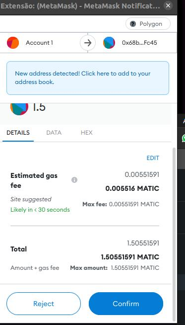

# Misión 7

En la última misión aprendimos a comprar MATIC. Hoy aprenderemos a cómo hacer un swap de tokens en un broker descentralizado.

### 1. ¿Qué es el Swap?

Hoy introduciremos el concepto de _swap_ el cual es, básicamente, intercambiar un token por otro. Por ejemplo, si tengo 10 MATIC y los quiero cambiar por ETH, intercambiaría mis 10 MATIC a la moneda ETH.

Este proceso puede hacerse en una casa de cambio centralizada, usando un libro de órdenes donde las personas colocan el precio de venta o el precio de compra y la casa se encarga de procesar las transacciones de compra o venta o también puede hacerse a traves de Smart Contracts. Ese es el caso de las casas de cambio descentralizadas ya que sus protocolos, es decir, los programas informáticos, son los que se encargan de realizar las operaciones, de forma segura. En la clase de hoy nos centraremos en las casas de cambio descentralizadas y utilizaremos [Uniswap](https://app.uniswap.org/#/swap?chain=mainnet).

### 2. Uniswap

Uniswap es la casa de cambio más conocida y una de las más usadas porque fue una de las primeras. Su protocolo fue implementado en la red Ethereum, siendo la primera red que visibilizó los Smart Contracts.

A medida que otras redes fueron evolucionando, Uniswap implementó su protocolo en otras redes y hoy es llamada _multi-chain_, es decir, multiredes.

Uniswap se transformó en un ecosistema de varias aplicaciones descentralizadas, además del swap también tiene protocolos para inversiones, préstamos y casi todo lo relacionado con DEFI (acrónimo de _Decentralized Finance_, que en español significa Finanzas Descentralizadas).

Para saber más sobre este ecosistema, entra a [este enlace](https://uniswap.org/).

### 3. Hacer Swap de MATIC


**Importante**! Haz las misiones con los mismos valores descritos en este tutorial y las capturas de pantallas, ya que la validación también tiene lugar en los valores de la transacción.

En este caso, el swap requiere MÍNIMAMENTE de 1.5 MATIC.

En las capturas mostradas, el valor de 1.5 MATIC fue convertido a 1 USDC, pero eso puede variar con el valor del MATIC en el momento que tu estés realizando el experimento. Por lo tanto, verifica la cantidad resultante de MATIC antes de hacer el swap.


Para la misión de hoy, vamos a hacer un Swap de una parte del MATIC que sobró en nuestra wallet luego de las misiones anteriores. El swap, así como otras operaciones, también tiene un costo de _gas_, ya que interactúa con un smart contract para intercambiar un token a otro. ¡Vamos a ello!

Entra al sitio de Uniswap en [https://uniswap.org/](https://uniswap.org/)

 (1).png>)

Haz click en el botón _Launch App_ en la esquina superior derecha. Tu pantalla debería ser similar a esta:

.png>)

La interfaz es muy sencilla. Tenemos dos botones donde seleccionaremos los tokens a ser intercambiados en un botón para conectar la cartera. Toma en cuenta que la moneda de conversión por defecto es Ethereum pero, para la misión de hoy, nuestra moneda será MATIC que se ejecuta en la red Polygon, como vimos en la misión 2.

Como Uniswap es multi-chain, soporta varias redes. Aquí, en la esquina superior derecha, verás una lista de selección con Ethereum seleccionado. Vamos a cambiarlo a Polygon, que es la red que queremos usar.

.png>)

Mira cómo el color de fondo ha cambiado :)

Ahora conectaremos la cartera. Haz click en el botón `conectarse a la cartera.`.

.png>)

Aquí tenemos varias opciones de cartera, pero como en las misiones anteriores, vamos a utilizar Metamask.

.png>)

La pantalla del sitio web se verá así y la extensión de Metamask se abrirá en tu pantalla. La pantalla de Metamask se verá así:

.png>)

Escoge la cuenta que está siendo usada para el experimento y haz click en `siguiente`:

.png>)

Aquí verás los permisos que estarás dando al sitio, similar a los permisos de la misión 5. Son permisos básicos de lectura, saldo y actividad, además de iniciar una transacción (con tu confirmación).

Después de conectar la cartera, el sitio web se verá así:

.png>)

Podemos ver varias cosas en la interfaz. El token a ser intercambio, nuestro saldo de MATIC, la dirección de nuestra cartera y los valores de la conversión. Tu saldo aparecerá debajo del token MATIC, mostrado a continuación. Ahora, del lado izquierdo de MATIC, ingresa el valor de los tokens a intercambiar. Para esta misión, el valor será de 1.5 MATIC.

.png>)

Ahora, vamos a escoger cual token convertiremos en nuestra MATIC. Para la misión de hoy, utilizaremos USDC. USDC es una _stablecoin_.

Pero, ¿qué es eso?

Un stablecoin no es más que una criptomoneda con un valor fijado en alguna moneda fiduciaria. El USDC, como su nombre lo indica, tiene un valor fijado al dólar. Entonces, si el dólar vale R$ 5, el USDC también valdrá eso.

Existen varias _stablecoins_ vinculadas al dólar como: USDT, BUSD, USDD o DAI. No recomendamos usar USDT ya que hay rumores de que no hay un respaldo real en dólares y creemos que el USDC es el más seguro.

Continuando, haz click en **Selecciona un token** (en azul) y elige USDC:

.png>)

Después de escoger, tu pantalla debe ser parecida a esta:

.png>)

Para que podamos hacer este intercambio, es necesario que este par, MATIC vs USDC, tenga liquidez en la casa de cambio. Como ambas monedas son ampliamente utilizadas, no necesitamos preocuparnos por la liquidez de este par. Así que es seguro que, en cualquier momento que hagas este ejercicio, habrá liquidez para que hagas el intercambio.

En esta pantalla podemos ver, aproximadamente, cuántos USDC resultará de la conversión, nuestro saldo en ambas monedas y el valor de 1 USDC comparado con el de 1 MATIC. Toma en cuenta que el valor del USDC es el mismo que se representa en dólares, ya que es una _stablecoin_.

Básicamente, la cantidad de USDC que recibirás será 1.5 veces el precio de MATIC.

Haz clic en conversión para realizar la operación.


**¡Atención!** En este momento estás vendiendo parte de tu saldo en MATIC. En el momento que vendimos, tenemos que creer que el precio de la moneda no subirá porque eso significa una pérdida en el valor del saldo total de nuestra cartera.

Como estamos aquí para aprender y no estamos preocupados con el valor de los dos MATIC que compramos, podemos continuar tranquilamente.

En otros casos, necesitas estar bien seguro(a) de lo que estás haciendo.


.png>)

Aquí tenemos los valores de la tarifa del servicio y de la red. También puedes ver algunos detalles de la conversión de la moneda. Hay que tomar en cuenta que podemos tener una pequeña pérdida del token (debimos al cambio de precio mientras se realiza la operación + tarifas). La pérdida es mínima. La mayoría de las veces son centavos, como en este caso. Haz click en confirmar conversión:

.png>)

La pantalla seguirá cargando y Metamask se abrirá en tu navegador, porque Uniswap necesita tu confirmación para continuar con la operación. Tu pantalla se verá así:

Aquí tenemos el valor total de la transacción, incluida la tarifa del _gas_.


Este es el momento donde debes tener mayor atención. Debes verificar el valor que va a salir de tu cartera.


Este no es el caso con Uniswap, pero los sitios malignos podrían ordenar más MATIC de tu billetera en este momento. La pantalla de Metamask es lo que garantizará lo que verdaderamente sucederá. Fíjate que aparece en letras grandes el valor de 1.5 MATIC que se le envía a Uniswap para poder realizar la conversión.

La tarifa de gas ya está estimada por Metamask pero puedes alterarla haciendo click en _Edit_. Solo haz esto cuando estés más familiarizado(a) con los precios del _gas_. Observa que en este ejemplo, el costo del _gas_ sugerido fue de 0.005516 MATIC que al precio de $0.68 por MATIC (en la fecha que se escribió el tutorial) representa $0.00379, es decir, una fracción de un centavo de dólar que, en reales, da R$0.02 (dos centavos de reales).

Haz click en confirmar para finalizar la transacción:

.png>)

¡La operación fue finalizada!


No salgas de esta pantalla antes de finalizar la transacción. Es importante hacer click en Ver en el Explorer para que puedas copiar el hash de la transacción, ya que esta es la prueba de la tarea que enviarás en Discord.


Haz click en visualizar en el explorador para ver la transacción:

.png>)

¡Bien! Conseguimos hacer un swap de MATIC a USDC con éxito.

### 4. Importando el token USDC

Ahora vamos a importar el token USDC para nuestra cartera, para que podamos ver el saldo.

Entra en tu metamask y haz click en importar tokens, justo debajo de donde están tus tokens MATIC. Ya hemos hecho esto antes, en la misión 2 cuando importamos el token MATIC.

.jpg>)

Ahora copia la dirección que está abajo y coloca en el campo Token Contract Address:

> 0x2791Bca1f2de4661ED88A30C99A7a9449Aa84174 Los demás campos se rellenarán automáticamente. Luego, haz click en _Add Custom Token._

Confirma la importación de USDC y nota que el saldo ya aparecerá. Ese saldo tendrá el valor del swap que hemos hecho en la misión anterior (aproximadamente 1 USDC en la cotización actual).

### 5. ¡Listo! ¡Ahora envía el hash de la transacción en Discord

¡Felicidades por completar la misión!

¡Estamos progresando mucho! ¡Aprendimos a hacer un swap y entendemos lo que es una stablecoin y Uniswap! Estas habilidades básicas son muy útiles en el mundo de la Web3 ya que, esto permite que tú puedas utilizar todos los servicios descentralizados que estamos construyendo.

Para recibir la recompensa, manda el hash de la transacción en el canal de la misión 7 en Discord. Mi hash, por ejemplo, comienza con 0x40d84ef.

Al enviar el mensaje, ¡no escribas más nada que el hash de la transacción!
