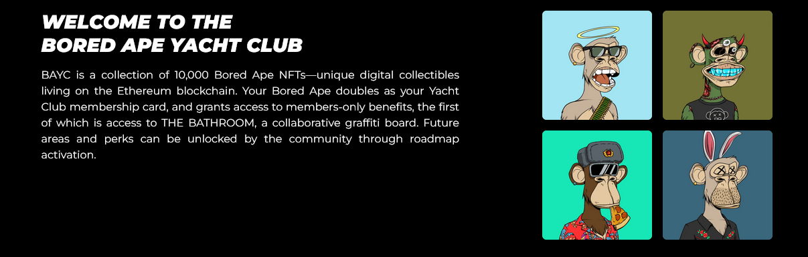

# Misión 9

En la última misión aprendimos a hacer transacciones reales utilizando el token USDC. En la misión de hoy, vamos a aprender qué es snapshot, su función y la importancia en aprender a usarlo en la práctica.

## 1. Snapshot

Snapshot es un sistema de votación descentralizado. Es un sistema utilizado por las DAOs para hacer gestiones de gobernanza. Muchos tokens tienen una utilidad de gobernanza y permiten que los titulares del token, voten en asuntos determinados relevantes a la DAO.

Ese sistema de votación es extremadamente importante y útil cuando hablamos de descentralización, por eso, si tú quieres participar algún día en una DAO, es importante aprender a registrar tu voto y participar en la gestión de la DAO de forma activa.

El sistema proporciona flexibilidad en cómo se calcula el poder del voto para un voto. Soporta múltiples tipos de votación para adaptarse a las necesidades de cada organización. La creación de propuestas y la votación en Snapshot son user-friendly y no tiene costo de gas, ya que es un proceso _off-chain_.

Crear propuestas y votarlas es gratis (no tiene costo de _gas_), los votos son mensajes suscritos que pueden ser verificados en línea. Snapshot ofrece múltiples sistemas de votación, estrategias de votación flexibles para calcular los resultados y todo esto es de código abierto.

En una organización descentralizada (DAO), por ejemplo, las votación de Snapshot pueden ser usadas para decidir lo que se hará en la empresa. Los votos pueden ser hechos utilizando tokens (como el nuestro, MELK), NFTs y otros activos digitales. Para esta misión, vamos a utilizar un espacio creado para ellos, donde aprenderemos a votar usando Snapshot.

## 2. DAOs

¿Qué es una DAO? ¿Qué tiene que ver con nuestra misión? Vamos a entender esto ahora.

Las DAOs u organizaciones distribuidas y autónomas, formalizando el concepto, son grupos de personas con metas y objetivos en común, siendo este grupo organizado por un liderazgo descentralizado, tomando decisiones a traves de votaciones.

En un análisis con el mundo de la Web2, una DAO es una empresa, sin embargo, nadie es el jefe. La DAO está dirigido por todos, a traves de sistemas de votación y ahí, es donde entra el Snapshot. La propuesta de las DAOs es establecer una empresa u organización que funcione sin la presencia de una jerarquía. Las DAOs también hacen uso de los _smart contracts_, es decir, de contratos de código que son inmutables, para implementar operaciones automatizadas que nadie controla.

Vea [este video de referencia](https://youtu.be/Pyi8-qm02hs).

Las DAOs tienen propuesta que apuntan a la resolución de problemas, permitiendo el libre moldeado de la organización y la posibilidad de presentar ideas innovadoras por cualquier persona (a traves del sistema de votación) y el registro de actividades en la blockchain (transparencia).

El concepto de las DAOs es muy nuevo en el mundo y aquí Brasil existen pocas DAOs; Podemos citar como ejemplo a [Web3dev](https://docs.web3dev.com.br/) y a [Bankless Brasil](https://forum.banklessbr.com/).

## 3. ¿Cómo podemos trabajar en una DAO?

Después de esta introducción al concepto DAO, puedes estar preguntándote: ok, pero, ¿cómo funciona trabajar para una DAO?

Para explicar el flujo del trabajo, voy a usar como ejemplo a Web3dev, una DAO que cité más arriba. La Web3dev es una DAO enfocada en la educación y el trabajo en las tecnologías de la Web3. La estructura de la DAO está dividida en Pods. Los Pods son grupos de trabajo, con estructuras definidas por la propia DAO y en el caso de la Web3dev, con 2 líderes. Este grupo (o Pod) se junta para resolver un problema o implementar algo en específico.

Si te interesa esta estructura, [lee sobre los PODs en el manual de la comunidad](https://docs.web3dev.com.br/pods/introducao).

Además de eso, la DAO tiene un presupuesto financiero que es usado para pagar a los miembros y líderes del POD.La gestión de esta actividad es hecha por los líderes del pod, en conjunto con los miembros, utilizando sistemas de votación descentralizado (Snapshot), de manera que todos puedan ayudar a construir una DAO y un mejor servicio. En el aspecto financiero, es importante destacar que cada DAO posee una estructura diferente, pero en la Web3dev los líderes del Pod reciben 100 USD y los miembros reciben 50 USD. El valor de esta remuneración es algo que podría ser propuesto y votado usando Snapshot.

## 4. Gobernanza

La gobernanza de una DAO representa la manera en la cual la DAO será gobernada, es decir, cómo las propuestas serán hechas y ejecutadas. Usando el ejemplo de la Web3dev de nuevo, la DAO será gobernada por los titulares de W3D. La política es que la asignación de la tesorería (para la financiación, liquidez e inversión), los cambios de proveedor de servicios y actualizaciones de los tokenomics (gobernanza, abastecimiento, distribución) sólo serán realizadas luego de una propuesta y votación exitosa. En el caso de la Web3dev, la gobernanza está siendo implementada de forma gradual y en fases. En el inicio de la DAO, todas las decisiones serán tomadas por los fundadores de la Web3dev, después serán manejadas por la comunidad.

Pero, ¿por qué los fundadores toman las decisiones al comienzo?

Esto sucede porque al inicio de una DAO, las decisiones tomadas por los fundadores hacen que el desenvolvimiento inicial sea más rápido y práctico, permitiendo una toma de decisiones rápida y con menos burocracia. A medida que las DAO crecen, las decisiones tomadas van siendo pasadas a la comunidad y, eventualmente, la gobernanza será totalmente implementada.

## 5. Melk DAO

Después de comprender qué es una DAO, cómo funciona, sus ventajas y diferencias para una empresa, es importante resaltar: el experimento MELK también es una DAO. Creemos en el trabajo descentralizado y en construir una comunidad colaborativa. Por eso, ¡hoy les vamos a enseñar cómo juntarse a nuestra DAO para que voten en contra o a favor de las propuestas!

## 6. Ser parte de la DAO MELK

Para comenzar, vamos a entrar al sitio snapshot en el siguiente enlace:



La página debe parecerse a esta:

Vamos a entender la pantalla. Es muy sencillo, tenemos varios ejemplos de “espacios”. Eso es lo que llamamos el espacio de votación en Snapshot. Cada espacio representa una DAO. También vemos un botón familiar, conectar la billetera.

Para entrar al espacio de la DAO Melk, en primer lugar, vamos a conectar nuestra billetera:

.png>)

Haz click en _Connect wallet_, tu pantalla debe ser similar a esta:

.png>)

Haz click en el ítem donde está escrito MetaMask.

Al hacer click, un pop-up se abrirá solicitando tu clave del Metamask y mostrando los términos para conectar la cartera, como ya hemos hecho varias veces en el correr de nuestras misiones.

Después de conectar la billetera, en tu pantalla debe aparecer esto:

.png>)

Toma en cuenta que ahora, en la esquina superior derecha, se muestra tu dirección, ¡lo que quiere decir que estás conectado a snapshot! ¡Bien!

Ahora, para encontrar el espacio de nuestra DAO, del proyecto MELK, vamos a escribir melk en la barra de búsqueda:

.png>)

Al escribir melk, tu pantalla debe parecerse como la nuestra de arriba, mostrando nuestra DAO MELK como resultado. ¡Muy bien, encontramos la DAO del proyecto!

Ahora, vamos a ser parte de esta DAO. De esa manera, será posible acompañar las votaciones del proyecto e integrar a todos los participantes del proyecto en un solo lugar, ¡para que todos puedan contribuir con el crecimiento de nuestro proyecto Melk!

Haz click en el botón JoinUn Pop-up de Metamask debe aparecer en tu pantalla, como este:Un Pop-up de Metamask debe aparecer en tu pantalla, como este:

.png>)

Un Pop-up de Metamask debe aparecer en tu pantalla, como este:

.png>)

Haz click en confirmar para aceptar tu entrada en el espacio DAO MELK!

Al hacer click en confirmar, tu pantalla debe aparecer así:

.png>)

Date cuenta que ahora, en vez que aparezca Join, aparece Joined, lo que significa que pudiste entrar exitosamente en el espacio de la DAO. Además de eso, en la parte izquierda del sitio es posible ver el ícono del proyecto melk y una notificación.

Para ver el espacio, haz click en el ícono de la parte izquierda de la pantalla, señalado más arriba:

.png>)

Aquí está la página inicial del espacio de nuestra DAO en snapshot. Podemos ver las propuestas activas, crear nuevas propuestas, encontrar el Github y el sitio del proyecto Melk y visualizar cuántos miembros hacen parte de nuestro espacio.

Por ejemplo, vamos a visualizar una de las propuestas que algún usuario hizo para esta misión, en el testnet de snapshot.


Puede ser que esta votación ya no siga estando activa en el momento en el que tu estés haciendo esta misión.


.png>)

.png>)

Aquí podemos ver varias informaciones del proyecto, como la propuesta en sí, informaciones sobre el tipo de votación, los resultados y, por fin, la opción de votar.

Sin embargo, puedes notar, que si intentas hacer lo mismo y eres nuevo en el proyecto (es decir, obtuviste los melks luego que se creó la propuesta) no podrás votar, ya que los snapshot del saldo de melk de cada usuario se toma en el día de la creación de la propuesta y, este saldo corresponde al poder de voto.

Por este motivo, la prueba de la misión de hoy no será el voto en una propuesta, sino el hecho de haberte unido y ser parte de la DAO Melk y la creación de una propuesta, que haremos en la siguiente fase.

En el caso que quieras entender más sobre cómo Snapshot funciona como un todo, puedes leer más sobre eso en el siguiente link:



## 7. Creando una propuesta

Para la segunda parte de esta misión, vamos a crear una propuesta de la red de test de Snapshot. Esto es así porque en el mainnet de Snapshot, la DAO Melk será utilizada para la creación de propuestas reales y discusiones de lo que haremos en la DAO. Como tenemos a muchas personas haciendo el experimento, si todos creasen propuestas en el canal principal del Snapshot de la DAO, tendríamos muchas propuestas y un espacio contaminado.

Por eso, haz click en el link de abajo, que es el snapshot que sólo se usa como una versión de prueba:



Tu pantalla debe parecerse a esta

.png>)

Date cuenta que la interfaz es la misma que la del Snapshot. Conecta tu billetera del mismo modo que hicimos antes y busca Melk, también del mismo modo que hicimos antes. Después de hacer esos pasos, tu pantalla debería parecerse a esta:

.png>)

Ahora haz click en el botón New Proposal, señalizado arriba.

.png>)

Ahora, agrega el título y una descripción, como se señala arriba. La idea de esta propuesta es que puedas dar un feedback sobre el proyecto en general, sobre tu experiencia, el funcionamiento de las misiones, el mecanismo de recompensas, el soporte para los errores, en fin, las características que tu encuentras interesantes y para hacer críticas constructivas. Además de eso, también puedes hacer una propuesta de sugerencias de mejoras y otras cosas que puedas encontrar relevantes.

Cuando estés listo, haz click en Continue, también señalado arriba:

.png>)

Ahora, ingresa cualquiera de las dos opciones de selección y haz click en publicar. No cambies el sistema de votación. Aparecerá un pop-up de Metamask en tu pantalla:

.png>)

Desplázate hasta la parte inferior y haz click en aceptar.

.png>)

Date cuenta que ahora, tu propuesta está pendiente y apenas en 24h será publicada y permitirá que otras personas voten. Pero, para la verificación de esta misión, no hay problema en que estemos en el período de publicación. Por lo tanto, vamos a copiar el link de la propuesta.

Haz click en Share, o Compartir:

.png>)

Y luego en copiar link o copy link:

.png>)

## 8. ¡Listo! Manda el link de tu propuesta en Discord

¡Felicitaciones por completar la penúltima misión del proyecto MELK!

Estamos finalizando nuestra jornada. Aprendimos muchas cosas, entendimos qué es Snapshot, para qué sirve y aprendimos a interactuar con la plataforma, conectando nuestra wallet y entrando en el espacio del proyecto Melk. Además de eso, ¡también aprendimos a crear nuestra propia propuesta!

Para recibir tu recompensa, ¡envía el link de su nueva propuesta creada en nuestro espacio de snapshot demo! Mi link, por ejemplo, es:

[https://demo.snapshot.org/#/melkdao.eth/proposal/0xd39d502fae8549f00ea08334e7db19e2bfbb52b35b7f8ebcad086c37a14c8357](https://demo.snapshot.org/#/melkdao.eth/proposal/0xd39d502fae8549f00ea08334e7db19e2bfbb52b35b7f8ebcad086c37a14c8357)

Cuando envíes el mensaje, ¡no escribas más nada si no el link de la propuesta!
