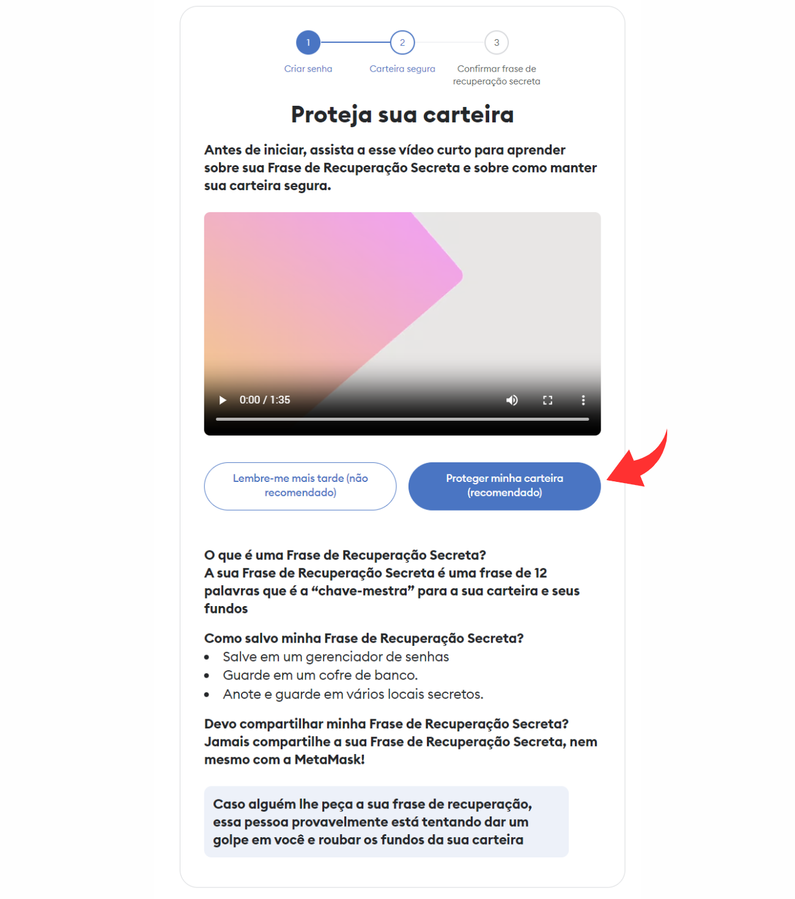
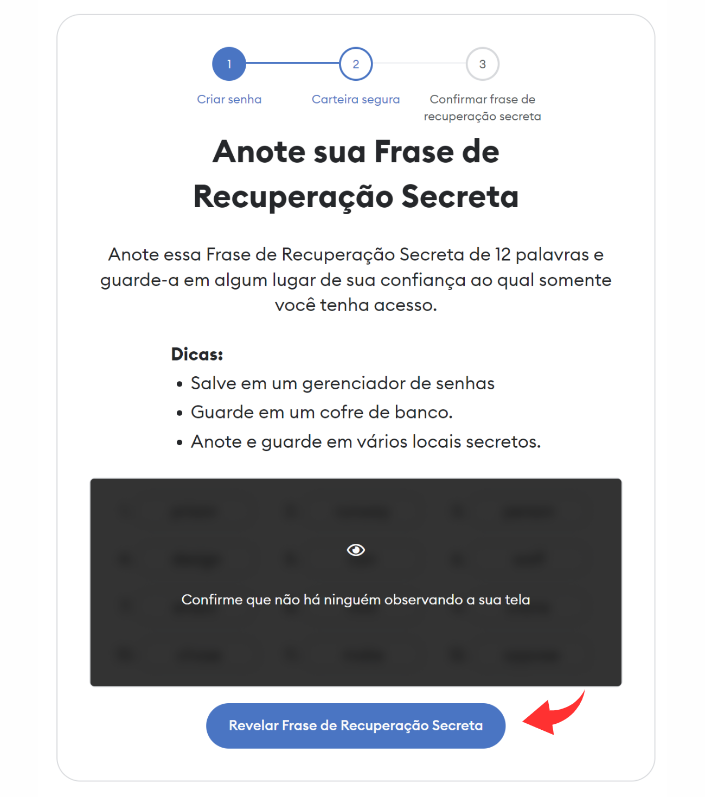
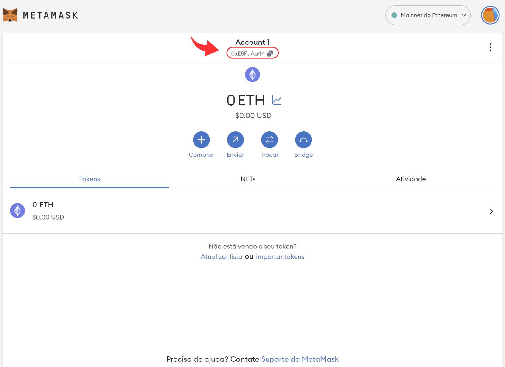
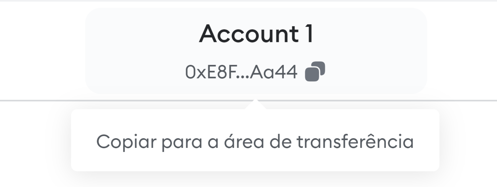

# Instalar uma carteira no Computador

### 1. Faça o download do app da MetaMask

Acesse a página de download da MetaMask em [https://metamask.io/download.html](https://metamask.io/download.html)

O site vai detectar qual o navegador você está usando e vai sugerir o link correto.


**Atenção!** É muito importate você confiar na fonte de onde você está fazendo a instalação. Se você instalar de uma fonte insegura, você pode instalar uma versão do app que poderá ser hackeado e seus fundos serão perdidos.


Você precisa se certificar que o link do site oficial está correto. Eu te digo, o site da MetaMask oficial é **metamask.io**

O tutorial foi feito usando o Chrome, mas as telas dos outros navegadores são muito similares e você não terá problema em seguir se baseando nessas aqui.


O meu computador está configurado para o idioma Inglês como padrão, então pode ser que as telas estejam um pouco diferente do seu computador se você tiver configurado para usar em Português.


### 2. Uma vez instalado, vamos mostrar o ícone como padrão

Ao clicar no ícone de extensões e no pin da MetaMask, o ícone da MetaMask vai aparecer na barra de ferramentas. Clique no ícone da metamask para abri a janela de configuração.

### 3. Como é sua primeira vez, leia e aceite os termos de uso e clique em Criar uma nova carteira.

<figure><figcaption></figcaption></figure>

### 4. No próximo passo clique em Não, agradeço

Você estaria permitindo que dados do seu uso sejam enviados para o time do aplicativo. Nenhum dado de carteira ou transação é compartilhado, nem qualquer dado que te identifique e eles prometem não compartilhar com ninguém. Não existe risco em permitir, mas eu particularmente prefiro não permitir.

### 5. Defina uma senha para uso da carteira.

Neste passo você precisa escolher uma senha para acessar a sua carteira. Qualquer pessoa que tiver acesso ao seu computador e saiba essa senha poderá ter acesso aos seus fundos e transferir o seu dinheiro.


**Atenção!** Escolha uma senha com pelo menos uma minúscula, uma maiúscula, um número e um caracter especial. Não anote essa senha em um papel e muito menos em um arquivo no seu celular ou computador. Recomendo o uso do [1Password](https://1password.com/pt/) para anotar suas senhas.


<figure><figcaption></figcaption></figure>

### **6. Configuração da carteira**

Você é o único responsável pela segurança da sua carteira. No ambiente web3 nào temos um banco para quem você pode reclamar e pedir o dinheiro de volta caso seja vítima de um ataque ou faça alguma besteira.

A sua carteira é o seu cofre, é por onde você vai manipular o dinheiro que você tem propriedade da Blockchain.

A sua carteira é acessada por um código, chamado chave privada. Essa chave privada é a senha que permite manipular o dinheiro da carteira. Essa chave privada é representada pelo conjunto de 12 palavras, chamadas de Secret Recovery Phrase (Frase de Recuperação Secreta).

Se alguém tiver acesso a essas 12 palavras, poderá obter todos os seus fundos.

<figure><figcaption></figcaption></figure>

### **7. Guarde a** Frase de Recuperação Secreta&#x20;

É muito importante você fazer a segurança de forma correta das sua Frase de Recuperação Secreta.


**Atenção!** Você não pode de maneira nenhuma anotar essas palavras no seu celular ou no seu computador, muito menos tirar uma foto da tela. Porque dessa maneira a informação vai ficar em risco caso o seu celular ou computador seja invadido.


A forma segura de guardar as palavras que formam a Frase de Recuperação Secreta é anotar em um papel com caneta esferográfica e guardar em um lugar seguro em sua casa, de preferência um cofre. Tem pessoas que envolvem o papel onde anotou as palavras em papel alumínio para preservar em caso de acidente.

Primeiro clique em Revelar Frase de Recuperação Secreta e depois anote as palavras na ordem que elas aparecem. Na tela seguinte você precisará escolher as palavras na ordem para conferir se você anotou certo.


A ordem das palavras é relevante para você conseguir recuperar a sua carteira.


<figure><figcaption></figcaption></figure>

<figure><figcaption></figcaption></figure>

### 8. Parabéns, carteira criada com sucesso!

<figure><figcaption></figcaption></figure>

### 9. Copiando o Endereço Público

O endereço público é um código que você compartilha com outras pessoas para que elas possam enviar moedas para você.

O endereço público é como o número da conta do seu banco, ou como se fosse a sua chave PIX.

O formato desse endereço muda de acordo com as diferentes blockchains. A Metamask usa blockchains baseadas no Ethereum e o formato é sempre uma sequência de códigos iniciada por 0x

O seu endereço aparece parcialmente abaixo do nome da conta (Account 1).

<figure><figcaption></figcaption></figure>

No meu caso o meu endereço aparece assim **0xE8F...Aa44**

Na verdade o meu endereço não é exatamente esse, porque ele está encurtado com três pontinhos no meio.

Para copiar o seu endereço público, clique nessa área com o código encurtado.

<figure><figcaption></figcaption></figure>

### 10. Pronto! Agora manda lá no Discord seu endereço público

Vá até o canal da Missão 1 no servidor do Discord onde você iniciou a trilha e envie a sua carteira para ganhar 1 MELK.


Lembrando! A suas palavras da Frase de Recuperação Secreta são a segurança de todos os seus tokens. Não salve no celular nem no computador, anote apenas com caneta em um papel e nunca compartilhe com ninguém. Alguns sites de fraude irão te pedir essas palavras para recuperar a sua carteira, mas nunca informe as suas palavras da Frase de Recuperação Secreta .

