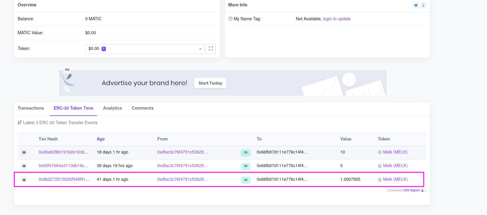

# Missão 4

Estamos aprendendo! Na missão passada aprendemos a encontrar as nossas transações no Polygonscan e visualizar as transações das recompensas de missões anteriores. Porém, o Polygonscan possui bastante detalhes que ainda não analisamos.

As transações possuem muitos dados que podem nos ajudar de diversas maneiras, entender como ela aconteceu, de onde ela vem, seu valor total, se algum erro ocorreu e assim por diante.

Recapitulando, na missão 1 você recebeu 1 ponto alguma coisa de token MELK. Tenha isso em mente, pois vamos falar dessa transação na missão de hoje.


Essa missão vai ensinar algumas coisas que vão parecer muito técnicas, mas são bem importantes para você ter um entendimento geral das transações, das taxas cobradas e evitar que você perca dinheiro à toa quando for fazer as suas transações reais.


### 1. Abrindo o Polygonscan

Para analisar mais a fundo as nossas transações, vamos precisar entrar novamente no Polygonscan, como na missão passada. Pode acessá-lo [aqui](https://polygonscan.com/). A tela deve se parecer com a minha.

 Blockchain Explorer.png>)

### 2. Procurando nossas transações

Como ensinado na aula passada, vamos agora acessar as nossas transações. Para isso, repita o processo da missão anterior: copie o seu endereço da carteira MetaMask e cole na barra de pesquisa do Polygonscan. O resultado deve ser parecido com o meu, mas com o seu endereço:

Vamos entender um pouco dessa tela.

### 2.1 Entendendo a tela

Primeiro, vamos entender cada seção dessa parte da tela (selecionada em roxo na imagem abaixo)

Vamos por partes:

**2.1.1 Overview**

A seção overview é bem simples, traduzido para português visão geral é bem autoexplicativa, é basicamente uma visão geral do resultado da nossa pesquisa (que é o seu endereço).

**2.1.2 Balance**

O balance, em português "saldo", representa quantos tokens você possui. O token padrão da rede Polygon é o MATIC, que não possuímos ainda. Por isso, nosso balance é 0 MATIC. Caso queria saber mais sobre ele, dê uma olhada [nesse link](https://coinext.com.br/matic).

**2.1.3 MATIC Value**

Esse campo apresenta, em dólar, o valor total monetário que temos, levando em conta o nosso balance. Como não possuímos nenhum token MATIC, o nosso valor monetário é 0. Mas, se tivéssemos 1 token MATIC, por exemplo, o valor apresentado nesse campo dependeria da [cotação diária](https://coinmarketcap.com/currencies/polygon/) do token. No dia em que escrevo, o MATIC está valendo U$1.69 (em dólar), o que com o valor do dólar atual ficaria perto dos 9 reais.

**2.1.4 Token**

Essa seção é onde vamos conseguir identificar os nossos tokens MELK. Acompanhe através da tela abaixo:

Note que o valor monetário da seção Token também está zerado. Isso ocorre porque o token MELK não tem um valor monetário em primeiro momento, como explicado [nessa seção](https://melk.gitbook.io/aprenda-e-ganhe/aprender-e-ganhar) . Note o número 1 em roxo (destacado pela flecha). Ele representa que temos um contrato de token (que no nosso caso, é o MELK). Clique no dropdown do campo (ao lado da área circulada, sinalizado no print abaixo). O resultado será como esse:

Veja que o valor em dinheiro e a quantidade de tokens ERC-20 aparece separadamente do MATIC. Isso acontece pois tokens ERC-20 não são tokens padrão da rede Polygon, são construídos por outros desenvolvedores, como o nosso token MELK. Nessa seção, conseguimos identificar o token MELK e quantos tokens nós possuímos (completando as duas primeiras missões, 6 tokens + casas decimais).

Agora, clique na parte onde está escrito Melk(MELK), com o seu saldo embaixo, como na imagem:

Isso vai nos levar para uma outra página:

 Token Tracker PolygonScan.png>)

Essa página apresenta várias informações do contrato do token MELK. Note que no overview (visão geral), conseguimos ver o preço, a quantidade total de tokens criados, e o campo **Holders,** que representa o número de pessoas que possuem algum token MELK.

Agora vamos voltar para a tela anterior (com a busca do nosso endereço feita) e aprender mais sobre nossas transações.

### 3. Analisando as transações

Agora, como anteriormente, vamos encontrar nossa transação no padrão ERC-20 Token Txs, ao lado de Transactions. O resultado deve ser parecido com esse:

Vamos entender essa tela e analisar seus componentes, mas primeiro clique na transação da primeira missão, com 1 ponto alguma coisa de MELK:

Aqui vamos poder ter uma visão maior da transação e entender o que cada parte significa. Sua tela deve ser parecida com isso:

 Details PolygonScan.png>)

Clique em “Click to see More” para expandir a seção.

### 3.1 Transaction Hash

O transaction hash (em português, Hash da Transação) é um valor único que a transação produz quando criada. Esse hash representa unicamente aquela transação, e cada uma tem um hash diferente. É possível, por exemplo, no Polygonscan, procurar a transação pelo hash que ela possui. É um identificador único.

### 3.2 Status

O status da transação basicamente indica o que aconteceu com ela, se a chamada foi completada com sucesso ou se falhou por algum motivo. No nosso caso, veja que está escrito _Success_, que indica que a transação foi enviada com sucesso.

### 3.3 Block

O termo blockchain é a junção das palavras block (bloco) + chain (cadeia), ou seja cadeia de blocos. Conforme explicamos na Missão 1, ele é composto por uma cadeia de blocos, e cada bloco possue inúmeras transações, é a forma que os dados são armazenados.

O block nesta tela é o número do bloco em que a nossa transação foi gravada. Logo ao lado, é possível ver um registro de _Block Confirmations_, que representa quantos blocos já foram adicionados depois da confirmação da transação.

### 3.4 Timestamp

A timestamp é bem auto explicativa, e serve basicamente para armazenar a data e horário em que a transação foi validada.

### 3.5 From

O campo from representa o remetente da transação, lembrando que ele pode ou não ser um contrato. É um endereço, como o nosso. Neste caso é o endereço da carteira do BOT Melk que distribuí os tokens MELK.

### 3.6 Interacted With (to)

Esse campo representa com quem ou o quê a transação interagiu, e nesse caso está relatando um contrato. O símbolo verde ao lado do endereço do contrato demonstra que o contrato foi executado com sucesso. Se fosse uma transação de transferência de MATIC que é a moeda padrão da rede Polygon o To seria o endereço da carteira do destinatário que recebeu o valor da transferência.

### 3.7 Tokens Transferred

Apresenta três partes:

* From: representa o endereço que enviou os tokens
* To: o endereço que recebeu os tokens
* For: a quantidade de tokens transferida na transação e o nome do token

É importante notar que na sua carteria MetaMask o valor da transação da recompensa da missão 1 não aparecerá com todas as casas decimais. Entretanto, o valor real total da transação está retratado nesse campo. O MetaMask omite tantas casas decimais para melhor experiência de usuário.

### 3.8 Value

O valor representa o valor monetário da transação. Nesse caso, o token MELK não tem valor financeiro. Logo, o valor que aparece é 0 MATIC ($0.00)

### 3.9 Transaction Fee

Esse campo representa o valor pago para o minerador pela validação da transação. Todas as transações na blockchain precisam pagar taxas, mesmo que o token MELK não tenha valor financeiro.

Perceba que neste caso nós pagamos uma taxa para poder enviar os tokens MELK pra você. Para rodar o nosso experimento nós estamos pagando essas taxas para cada pessoa que completa uma missão, esse é um custo que temos por rodar esse projeto.

### 3.10 Txn Type

Representa o tipo de transação realizada. Nesse caso, encaixa-se em uma mudança implementada no EIP-1559. Essa foi uma mudança implementada pra ter um valor fixo de gas que é queimado (burned), e que o valor seja ajustado com base no bloco, buscando um preço médio com menos oscilação.

Para saber mais sobre o EIP-1559, dê uma olhada [nesse link](https://artigos.banklessbr.com/p/eip-1559-explicado?s=r).

### 3.11 MATIC Price

Esse campo representa o valor de fechamento da moeda MATIC no dia da transação. O valor é representado em dólar, usado para calcular o valor total em dinheiro do gas e saber qual valor foi utilizado como base.

### 3.12 Gas Limit

É a quantidade máxima de gas disponibilizada para aquela transação específica, escolhida pelo pagador. Isso significa que se a quantidade de gas ultrapassar o valor escolhido, a transação não será completada.

Quando uma transação é realizada, você pode escolher a quantidade máximo de gas que você está disposto a pagar pela transação.

### 3.13 Gas Used by Transaction

Esse campo mostra a quantidade de gas utilizada naquela transação em número absoluto e em porcentagem. Note que a porcentagem é calculada tendo como base o valor limite de gas que aparece no campo anterior.

### 3.14 Base Fee Per Gas

É a taxa base por gas, determinada pela rede. Também acaba queimada no final do processo. Essa taxa depende diretamente do bloco anterior, aumentando ou diminuindo de acordo com o seu tamanho. (Bloco cheio, taxa aumenta; bloco vazio, taxa diminui).

O valor dessa base fee, no nosso caso, está medido em Wei (em números, 1 Wei é 1 quintilhão de um Ethereum) e também aparece em Gwei (1 Gwei = 0,000000001 Ethereum).

### 3.15 Max Fee Per Gas

Esse campo representa o valor máximo que um usuário está disposto a pagar pela realização da sua transação. O valor é medido em MATIC ou Gwei na rede Polygon. Esse valor também é escolhido por quem faz a transação. Quando você usa a Metamask ela sugere esses valores de acordo com a taxa de uso da rede no momento.

### 3.16 Max Priority Fee Per Gas

Esse valor (também em Gwei) representa quanto da transação será direcionada para o minerador. Pode ser configurada pelo usuário.

### 3.17 Burnt Fees

Esse campo mostra a quantidade em valor da taxa que foi queimada (burnt), explicado no [EIP-1559](missao-4.md#3.10-txn-type) referenciado acima.

### 3.18 Txn Savings

Esse valor resulta da seguinte operação matemática:

`(MaxFeePerGas - (BaseFeePerGas + MaxPriorityFeePerGas)) * GasUsed`

e representa o valor da taxa que foi salvo na transação.

### 3.19 Gas Price

É o preço por unidade especificado para a transação, em MATIC e em Gwei. Quanto maior for o preço da Gas, maior a chance da transação ser incluída no bloco.

### 3.20 Nonce / Position

É um número sequencial e escalar que representa o número de transações processadas por aquele endereço (da sua carteira por exemplo). Se o Nonce de uma transação for 4, por exemplo, seria a quinta transação mandada por aquele endereço.

A primeira transação que você realiza na sua carteira entra com o nonce zero e a próxima precisa ser enviada com o nonce igual a 1.

Já o Position é o índice da posição da transação no bloco em que ela se encontra.

### 3.21 Input data

São os dados binários que representam as informações que foram passadas para a transação, o _input_ dela, seja para o caso de uma chamada de mensagem ou interação com _smart contract_, ou até mesmo a criação de um _smart contract_.

### 4. Manda lá no discord o valor total da recompensa da primeira missão para receber a recompensa!

Vá até o canal da Missão 4 do Experimento MELK no discord e mande uma mensagem com o valor total que você recebeu de recompensa na missão 1, mencionado da seção Tokens Transferred. Escreva o valor cheio, com todos os pontos decimais e usando ponto como delimitador. No meu caso, a mensagem a ser enviada seria essa:

> 1.0007855

Qualquer dúvida, sinta-se livre para mandar mensagem no canal de ajuda.


Nessa missão, aprendemos muita coisa.

* Aprendemos a interpretar a tela simplificada das transações e a encontrar transações de outros tokens.
* Analisar e entender cada campo de uma transação completa, compreendendo os valores com os quais a rede trabalha.

