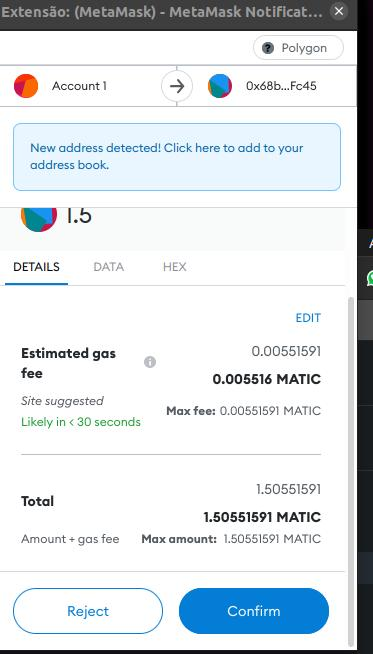
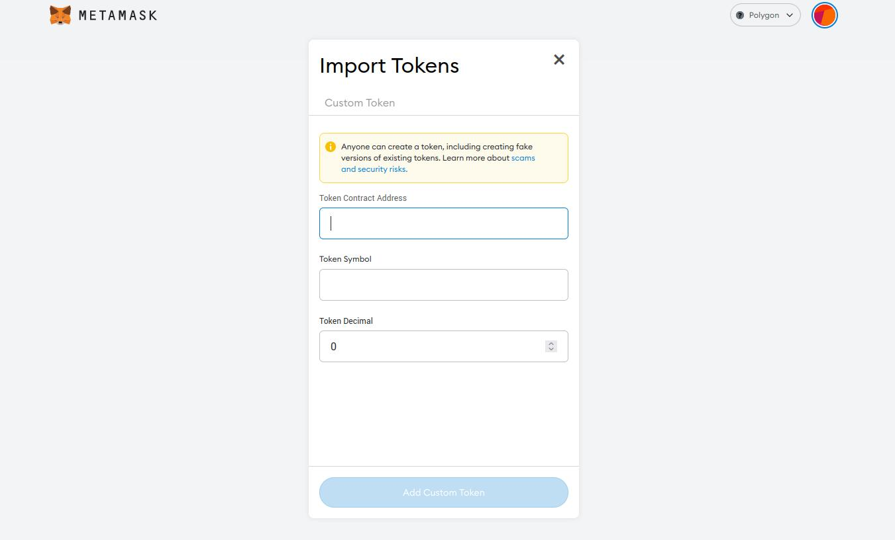

# Missão 7

Na última missão aprendemos a comprar MATIC. Hoje vamos aprender a fazer swap de tokens numa corretora descentralizada.

### 1. O que é Swap?

Hoje vamos introduzir o conceito de _swap_, que basicamente é trocar um token por outro. Por exemplo, se eu tenho 10 MATIC e eu quero trocar por ETH, eu faria swap dos meus 10 MATIC para a moeda ETH.

Esse processo pode ser feito em uma corretora centralizada, usando um livro de ordens, onde as pessoas colocam o seu preço de venda e preço de compra e a corretora se encarrega de processar as transações de compra e venda, ou pode ser feito através de Smart Contracts, que é o caso das corretoras descentralizadas, que são protocolos, ou seja, programas de computador que se encarregam de realizar a operação com segurança. Na aula de hoje, vamos focar nas corretoras descentralizadas e utilizar a [Uniswap](https://app.uniswap.org/#/swap?chain=mainnet).

### 2. Uniswap

A Uniswap é a corretora mais conhecida e um das mais utilizadas porque ela foi uma das primeiras. O seu protocolo foi implementado na rede Ethereum que foi a primeira rede que viabilizou os Smart Contracts.

Conforme as outras redes foram evoluindo, a Uniswap implementou o seu protocolo em outras redes e hoje ela é chamada de _multi-chain_, ou seja, multi redes.

A Uniswap se transformou em um ecossistema de vários aplicativos descentralizados, além do swap ela também tem protocolos de investimentos, empréstimos e quase tudo relacionado à DEFI (sigla para _Decentralized Finance_, que em português significa Finanças Descentralizadas).

Para saber mais sobre o ecossistema, entre [nesse link](https://uniswap.org/).

### 3. Fazendo Swap de MATIC


**Importante**! Realize as missões com os mesmos valores descritos neste tutorial e nas capturas de tela, pois a validação também ocorre nos valores da transação.

Neste caso o swap precisa ser de PELO MENOS 1.5 MATIC.

Nas telas mostradas, o valor de 1.5 MATIC era convertido para 1 USDC, mas isso pode variar com o valor do MATIC no momento que você estiver realizando o experimento. Portanto confira a quantidade resultante de MATIC antes de fazer o swap.


Para a missão de hoje, vamos fazer Swap de uma parte do MATIC que sobrou em nossa wallet após as missões anteriores. O swap, assim como outras operações, também custa _gas_, já que interage com um smart contract para trocar de um token para outro. Vamos lá!

Entre no site da Uniswap que fica em [https://uniswap.org/](https://uniswap.org/)

.png>)

Clique no botão _Launch App_ no canto superior direito. Sua tela deve ser parecida com essa:

.png>)

A interface é bem simples. Temos dois botões onde selecionaremos os tokens a serem trocados e um botão para conectar a carteira. Note que a moeda padrão de conversão é o Ethereum, mas para a missão de hoje nossa moeda será o MATIC que roda na rede Polygon, como vimos na missão 2.

Como a Uniswap é multi-chain, ela suporta várias redes. Lá no canto direito no topo, você vai ver uma lista de seleção com o Ethereum selecionado. Vamos mudar para a Polygon que é a rede que queremos usar.

.png>)

Veja que a cor do fundo mudou :)

Vamos agora conectar a carteira. Clique no botão `Conectar-se à carteira`.

.png>)

Aqui temos várias opções de carteira, mas como nas missões anteriores vamos utilizar a Metamask.

.png>)

A tela do site ficará assim e a extensão da Metamask abrirá na sua tela. A tela da Metamask se parecerá com essa:

.png>)

Escolha a conta que está sendo usada para o experimento e clique em `Seguinte`:

.png>)

Aqui terão as permissões que você estará dando para o site, parecidas com as da missão 5. Permissões básicas de leitura, saldo e atividade, além de iniciar uma transação (com a sua confirmação).

Depois de conectar a carteira, o site ficará assim:

.png>)

Podemos ver várias coisas nessa interface. O token a ser trocado, nosso saldo de MATIC, o endereço da nossa carteira e os valores de conversão. Seu saldo aparecerá embaixo do token MATIC, sinalizado abaixo. Agora, do lado esquerdo de MATIC, insira o valor de tokens a serem trocados. Para essa missão, o valor será de 1.5 MATIC.

.png>)

Agora, vamos escolher qual token iremos converter nossos MATIC. Para a missão de hoje, utilizaremos o USDC. O USDC é uma _stablecoin_.

Mas o que é isso?

Uma stablecoin nada mais é do que uma criptomoeda com um valor fixado em alguma moeda fiduciária. O USDC, como o nome indica, tem seu valor fixado no dólar. Então, se o dólar estiver valendo R$ 5, o USDC também estará.

Existem várias _stablecoins_. atreladas ao dólar, tais como USDT, BUSD, USDD, DAI. Nós não recomentamos o uso da USDT por rumores de que não há lastro real em dólar e achamos a USDC a mais segura.

Continuando, clique em **Selecione um token** (em azul) e escolha o USDC:

.png>)

Depois de escolher, sua tela deve se parecer com essa:

.png>)

Para que a gente consiga fazer essa troca é necessário que esse par MATIC vs USDC tenha liquidez na corretora. Como ambas as moedas são muito utilizadas não precisamos nos preocupar com a liquidez desse par. É certeza que a qualquer momento que você esteja fazendo esse exercício haverá liquidez pra você fazer a troca.

Nesta tela podemos ver aproximadamente quantos USDC essa conversão resultará, o nosso saldo nas duas moedas e o valor de um USDC comparado a 1 MATIC. Note que o valor de USDC é o mesmo representado em dólar, pois é uma _stablecoin_.

Basicamente a quantia de USDC que você receberá será 1 vez e meia o preço do MATIC.

Clique em conversão para realizar a operação


**Atenção!** Neste momento você está vendendo parte do seu saldo em MATIC. No momento que a gente vende, temos que acreditar que o preço da moeda não vai subir, porque isso significaria uma perda de valor do saldo total da nossa carteira.

Como estamos aqui apenas aprendendo e não estamos preocupados com a valorização dos MATIC que compramos, podemos seguir tranquilamente.

Em outros casos você precisa estar bem seguro(a) do que está fazendo.


.png>)

Aqui temos os valores de taxa de serviço e da rede e alguns detalhes de conversão da moeda. É possível perceber que podemos ter uma pequena perda do token (pela mudança de preço enquanto a operação acontece + taxas). Mas a perda é mínima, de no máximo centavos nesse caso. Clique em confirmar a conversão:

.png>)

A tela ficará carregando e a Metamask irá abrir no seu navegador, porque a Uniswap precisa da sua confirmação para continuar com a operação. Sua tela ficará como essa:

Aqui temos o valor total da transação, incluindo a taxa de _gas_.


Essa é a hora de maior atenção. Você precisa conferir o valor que vai sair da sua carteira.


Não é o caso da Uniswap, porém sites maliciosos poderiam comandar uma saída de mais MATIC da sua carteira neste momento. A tela da Metamask é que garante o que vai realmente acontecer. Veja que aparece em letras maiores o valor de 1.5 MATIC que está sendo enviado para a Uniswap para realizar a conversão.

A taxa de gas já é estimada pela Metamask, mas pode ser alterada por você se clicar em _Edit_. Só faça isso quando você já estiver mais familiarizado(a) com os preços de _gas_. Veja que neste exemplo o custo do _gas_ sugerido foi de 0.005516 MATIC que ao preço de $0.68 por MATIC (na data que escrevo este tutorial) representa $0.00379, ou seja, um fração de um centavo de dólar que em reais dá R$ 0,02 (dois centavos de reais).

Clique em confirmar para finalizar a transação:

.png>)

A operação foi finalizada!


Não saia desta tela antes de finalizar a transação. É importante clicar em Visualizar no Explorer para você poder copiar o hash da transação pois essa é a prova da tarefa que você enviará no Discord.


Clique em visualizar no explorer para ver a transação:

.png>)

Boa! Conseguimos fazer o swap de MATIC para USDC com sucesso!

### 4. Importando o token USDC

Agora vamos importar o token USDC para a nossa carteira, para conseguirmos ver o nosso saldo.

Entre na sua metamask e clique em importar tokens, logo abaixo de onde ficam seus tokens MATIC. Nós já fizemos isso antes na missão 2 quando importamos o token MATIC.

Agora copie o endereço abaixo e cole no campo Token Contract Address:

> 0x2791Bca1f2de4661ED88A30C99A7a9449Aa84174

Os outros campos preencherão-se automaticamente. Em seguida, clique em _Add Custom Token._

Confirme a importação do USDC, e note que o saldo já aparecerá. Esse saldo será o valor de swap que fizemos na missão anterior (aproximadamente 1 USDC na cotação atual).

### 5. Pronto! Agora manda lá no discord o hash da transação!

Parabéns por completar a missão!

Estamos evoluindo bastante! Aprendemos a fazer swap e entendemos o que é uma stablecoin e a Uniswap! Essas habilidades básicas são muito úteis no mundo da web3, já que isso permite que você utilize todos os serviços descentralizados que estamos construindo.

Para receber sua recompensa, mande o hash da transação no canal da missão 7 do Discord. O meu hash por exemplo, começa com 0x40d84ef

Quando mandar a mensagem não escreva nada além do hash da transação!
